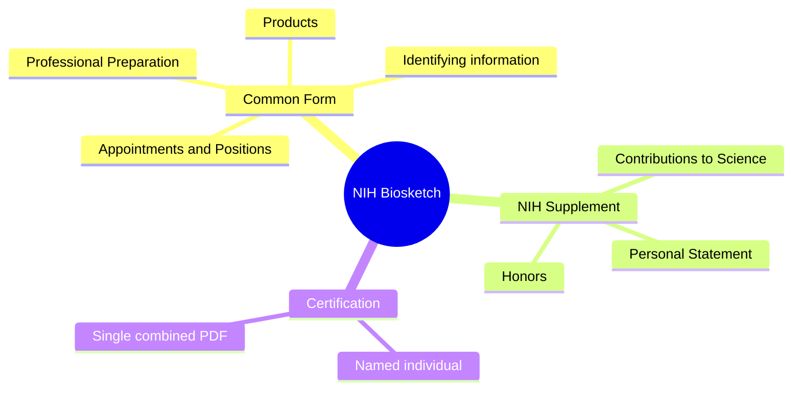

# NIH Biosketch (Common Form + Supplement)

This section walks through producing the NIH Biographical Sketch in SciENcv: the **Biographical Sketch Common Form** plus the **NIH Biographical Sketch Supplement**, certified and downloaded as a single PDF.

**Diagram summary:** The combined biosketch contains Common Form data, NIH Supplement narratives and honors, and one certification by the named individual.

