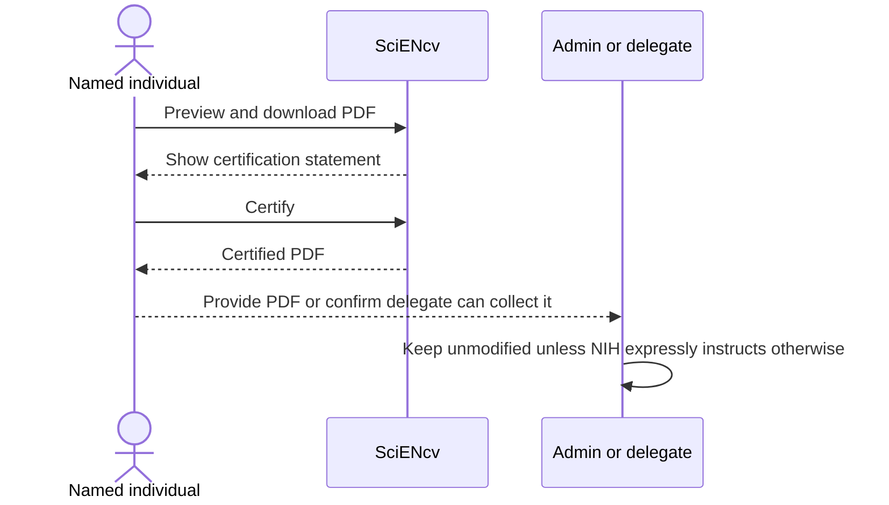

# Certify + download (individual-only step)

1. Click **Download PDF**
2. Read the certification statement carefully
3. Click **Certify**
4. Download the generated PDF

{: .warning }
> **Delegates cannot certify.** The **individual named on the biosketch** must certify from their own SciENcv account.  
> The certification includes a legal attestation (including malign foreign talent program language).

{: .warning }
> Do **not** Print to PDF / “Optimize” / flatten this file by default. Submit the SciENcv-generated PDF as-is unless the NIH Application Guide or NOFO expressly requires a special compiled/flattened attachment, such as participating-faculty biosketches.

{: .note }
> You **may rename the downloaded PDF file** to match NIH filename guidance, but do **not** alter the PDF content. If the document changes, or if the certification/signature date is more than **12 months** old at submission time, download and **re-certify**.

## Application research-security check

For NIH applications:

- each senior/key person must have completed qualifying Research Security Training (RST) within the **12 months before application submission**;
- the person certifies completion through the SciENcv biosketch; and
- the AOR provides a separate institutional certification through the application signature for each covered individual employed by the applicant organization.

The biosketch certification also includes the individual MFTRP attestation. See [Research-security certifications]({{ site.baseurl }}) for the application and annual RPPR requirements.

{: .note }
> If a saved form does not include the required RST and MFTRP certifications, regenerate and re-certify it in the current SciENcv interface.

