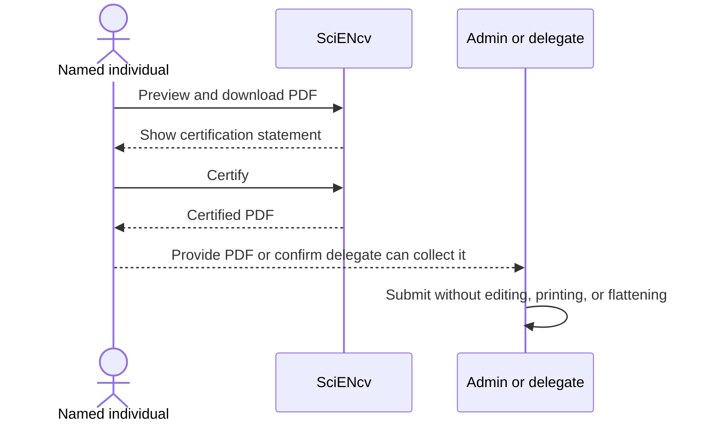

# Certify + download (individual-only step)

1. Click **Download PDF**
2. Read the certification statement carefully
3. Click **Certify**
4. Download the generated PDF

{: .warning }
> **Delegates cannot certify.** The **individual named on the biosketch** must certify from their own SciENcv account.  
> The certification includes a legal attestation (including malign foreign talent program language).

{: .warning }
> Do **not** Print to PDF / “Optimize” / flatten this file. Submit the SciENcv-generated PDF as-is.

{: .note }
> You **may rename the downloaded PDF file** to match NIH filename guidance, but do **not** alter the PDF content. If the document changes, or if the certification/signature date is more than **12 months** old at submission time, download and **re-certify**.

{: .warning }
> NIH added Research Security Training (RST) certification text back into SciENcv Common Forms on **April 22, 2026**. For applications with due dates on/after **May 25, 2026**, if a Common Form was certified before April 22 and has not yet been submitted, regenerate and re-certify the PDF before submission.

