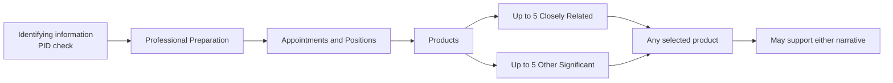

# Common Form sections (step-by-step)

## Identifying information

- Name, organization, and current position title
- **Persistent Identifier (PID)** — NIH expects your **ORCID iD** to appear here
- Confirm the ORCID shown in SciENcv matches the ORCID linked in **eRA Commons**

## Professional Preparation

- Baccalaureate or other initial professional education
- **All** postdoctoral and fellowship training
- Keep entries in reverse chronological order by **start date**
- Review for duplicates after ORCID import

## Appointments and Positions

- Put **current** appointments/positions first
- Include titled academic/professional/institutional appointments whether paid or unpaid, including adjunct, visiting, honorary, part-time, or voluntary roles
- Include outside appointments/positions for up to **3 years** from the application submission date
- Keep it consistent with what your institution discloses elsewhere

## Products (up to 10 total)

Two buckets:

1. **Closely Related to the Proposed Project** (up to 5)  
   Products closely related to the work proposed in the application.
2. **Other Significant Products** (up to 5)  
   Other significant products that highlight your Contributions to Science.

You do not need to fill all 10 slots. Either the Personal Statement or Contributions to Science may reference **any selected product**, regardless of which bucket contains it.

{: .note }
> **Practical strategy, not an NIH requirement:** closely related products often provide project-specific evidence for the Personal Statement, while other significant products often illustrate broader contributions. Use the bucket definitions above, but do not force a product-to-narrative mapping.

Acceptable products are broader than papers. Depending on what is **citable and accessible**, products can include:
- Journal articles, books/chapters, conference papers, and presentations
- Websites, software, code, models, and technologies/techniques
- Patents, patent applications, and licenses
- Data sets, databases, physical collections, research materials, and interventions
- Instruments/equipment, educational aids/curricula, and new business creation

{: .note }
> NIH says each product should follow the **NIH hypertext policy** and include the available citation details: **authors, title, publication/release date, URL, persistent identifier (if available), and other relevant citation information**. If one of those data elements truly does not apply, enter **N/A**.

{: .note }
> **Character limits matter more than pages**: the new format is driven by character limits in narrative fields, not a strict page cap.

Next: [NIH Supplement sections (step-by-step)]({{ site.baseurl }})
