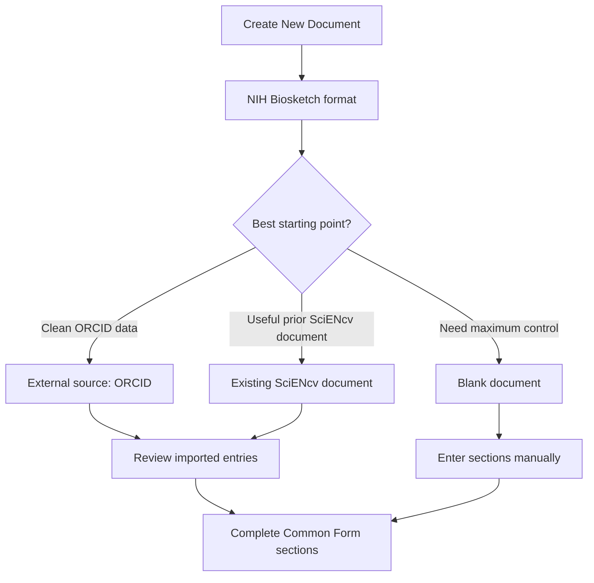

# Create the biosketch document in SciENcv

1. Log in to MyNCBI and open **SciENcv**
2. Click **Create New Document**
3. Choose:
   - **Format:** NIH Biosketch (Common Form + Supplement)
   - **Starting point (data source):**
     - **External source (ORCID)** to import education/employment (fastest when ORCID is clean)
     - **Start with existing SciENcv document** (helpful if you had an older biosketch)
     - **Blank** (slowest but most controlled)

{: .note }
> ORCID import saves time but can import duplicates or outdated entries—always review and edit.

Next: [Common Form sections (step-by-step)]({{ site.baseurl }})
