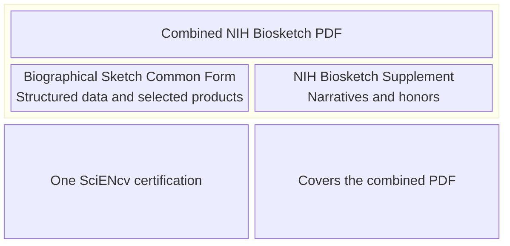

# Overview: what you’re producing

For NIH, the SciENcv output is effectively:

1. **Biographical Sketch Common Form** (structured data: identifying information, professional preparation, appointments/positions, and products)
2. **NIH Biographical Sketch Supplement** (narratives: personal statement, contributions to science, and honors)

{: .note }
> SciENcv prepares both parts in one interface. NIH expects **one certification** and **one combined PDF** for submission.

{: .warning }
> For an application, provide that combined biosketch for **every individual listed on the R&R Senior/Key Person Profile (Expanded)**, including every **Other Significant Contributor (OSC)**. See [NIH Common Forms FAQ 57968](https://grants.nih.gov/faqs#/common-forms-biographical-sketch-current-pending-support.htm?anchor=57968) and [FAQ 57969](https://grants.nih.gov/faqs#/common-forms-biographical-sketch-current-pending-support.htm?anchor=57969).

{: .note }
> There is **no page limit** for the combined NIH biosketch PDF.

{: .warning }
> The Personal Statement and Contributions to Science may use brief **in-text, parenthetical references** to any product selected in the Common Form. NIH recommends a lead-author/year reference or a PMID/PMCID. Do not include full bibliographic citations or hyperlinked references in the Supplement.

{: .note }
> **FY 2027 Extramural Loan Repayment Programs:** applications are accepted **Sep 1–Nov 19, 2026**. Every applicant uploads a digitally certified combined biosketch from SciENcv through ASSIST. A mentored applicant also uploads the primary mentor’s combined biosketch and may upload **one optional additional combined biosketch** for a mentoring-team member, co-mentor, or key recommender. Follow the [FY 2027 Extramural LRP Application Instruction Guide](https://grants.nih.gov/sites/default/files/Extramural-LRP-Application-Instruction-Guide.pdf) for the complete program-specific workflow.

**Diagram summary:** One SciENcv certification covers a combined PDF containing the Common Form and the NIH Supplement.

