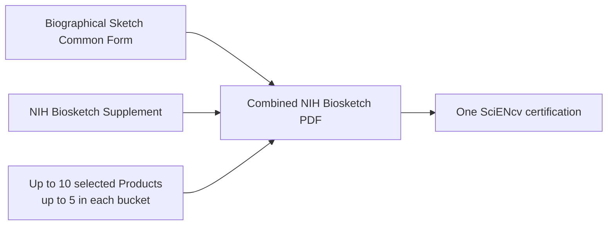

# Overview: what you’re producing

For NIH, the SciENcv output is effectively:

1. **Biographical Sketch Common Form** (structured data: identifying information, professional preparation, appointments/positions, and products)
2. **NIH Biographical Sketch Supplement** (narratives: personal statement, contributions to science, and honors)

{: .note }
> SciENcv prepares both parts in one interface. NIH expects **one certification** and **one combined PDF** for submission.

{: .note }
> There is **no page limit** for the combined NIH biosketch PDF.

{: .warning }
> The Personal Statement and Contributions to Science may use brief **in-text, parenthetical references** to any product selected in the Common Form. NIH recommends a lead-author/year reference or a PMID/PMCID. Do not include full bibliographic citations or hyperlinked references in the Supplement.

{: .note }
> **Extramural Loan Repayment Programs:** the current [LRP-CR](https://grants.nih.gov/grants/guide/notice-files/NOT-OD-26-081.html), [LRP-PR](https://grants.nih.gov/grants/guide/notice-files/NOT-OD-26-082.html), and [LRP-FOCUS](https://grants.nih.gov/grants/guide/notice-files/NOT-OD-26-083.html) notices require applicants to submit a digitally certified combined biosketch from SciENcv through ASSIST during the **Sep 1–Nov 19, 2026** receipt period. Mentored applicants also provide the mentor’s combined biosketch. Follow the program-specific LRP instructions for the other, separately entered application materials.

