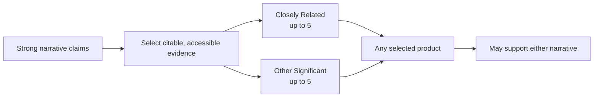

# Products strategy (how to pick up to 10)

NIH permits **up to 5** products in each of two buckets, for **up to 10 total**. You do not need to fill every slot.

{: .note }
> Products can include more than journal papers (for example: software, datasets, patents, technologies, and educational materials). Each selected product must be citable and accessible.

## NIH bucket definitions

- **Closely Related to the Proposed Project:** up to 5 products closely related to the proposed work.
- **Other Significant Products:** up to 5 other significant products that highlight your Contributions to Science.

Both the Personal Statement and Contributions to Science may use brief parenthetical references to **any selected product**, regardless of bucket.

## Practical selection strategy

This is writing strategy, not an NIH rule:

- Start with the strongest claims in both narratives, then identify the products that substantiate them.
- Place each product in the bucket that best matches the official definition above.
- Project-specific evidence will often fit the Closely Related bucket; broader field impact will often fit Other Significant Products.
- Do not force a one-product-per-contribution pattern or a rigid product-to-narrative mapping.
- Leave slots unused when a product would not strengthen the case.

Worksheet:
- [Product selection worksheet (up to 10 slots)]({{ site.baseurl }})

