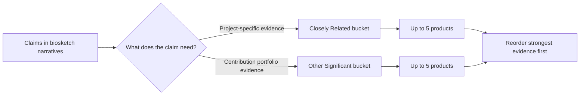

# Products strategy (how to pick the 10)

Because you only get **10 total** products, selection is strategic:

{: .note }
> Products can include more than journal papers (for example: software, datasets, patents, technologies, and educational materials). Choose the strongest evidence for your specific claims **and make sure each item is citable/accessibly described in SciENcv**.

## Bucket A (Closely Related): “evidence for your personal statement”

Pick items that directly prove claims you make about:
- Techniques you will use
- Prior results that de-risk the approach
- Domain expertise for the aims

## Bucket B (Other Significant): “portfolio for your contributions”

A good default pattern:
- 1 “anchor” product per contribution (up to 5)

Worksheet:
- [Product selection worksheet (10 slots)]({{ site.baseurl }})

