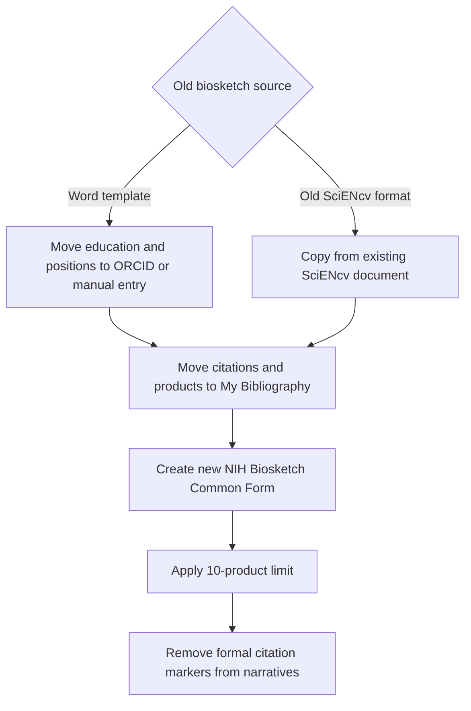

# Transition from the old NIH biosketch

## If you previously used Word

- No automatic import from Word
- Move data upstream:
  - ORCID (education/positions)
  - My Bibliography (citations/products)
- Copy narratives into SciENcv and remove inline citations

## If you previously used SciENcv (old format)

- Create a new Common Form document
- You may copy from an older document, but:
  - Reduce citations to the new 10-product limit
  - Remove citation markers in Personal Statement and Contributions

