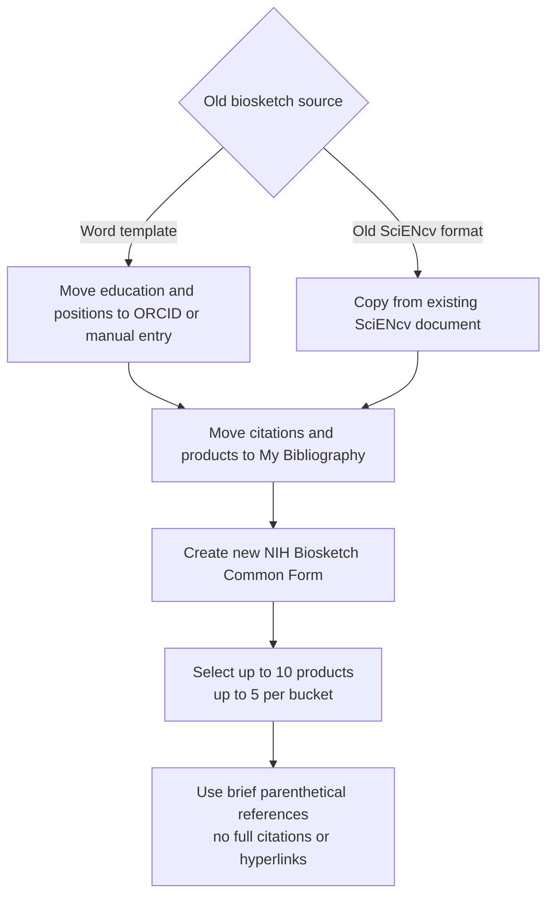

# Transition from the old NIH biosketch

## If you previously used Word

- No automatic import from Word
- Move data upstream:
  - ORCID (education/positions)
  - My Bibliography (citations/products)
- Copy narratives into SciENcv and replace old reference lists or citation markers with brief parenthetical references to selected products, when useful

## If you previously used SciENcv (old format)

- Create a new Common Form document
- You may copy from an older document, but:
  - Select up to 5 closely related products and up to 5 other significant products
  - Replace full bibliographic citations and hyperlinked references in the narratives with brief parenthetical references to selected products (lead author/year or PMID/PMCID)

