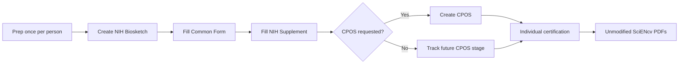

# Complete walkthrough (Biosketch + CPOS)

This page consolidates the end-to-end steps (PI + admin) for both documents.

## 0) Prep (do once per person)

- Confirm **eRA Commons ID**
- Create **ORCID iD**
- Link ORCID in **eRA Commons** (**required**)
- Confirm the same ORCID appears as the **SciENcv PID** (link ORCID in MyNCBI/SciENcv, sign in with ORCID, or manually enter it)
- Clean **My Bibliography** (publications + non-traditional products)
- Add **delegate** (optional)

## 1) Create the NIH Biosketch in SciENcv

1. MyNCBI → SciENcv → Create New Document
2. Format: NIH Biosketch (Common Form + Supplement)
3. Choose a starting point:
   - ORCID import (fast)
   - Copy from existing SciENcv doc (if you had one)
   - Blank (manual)

### Fill the Common Form

- Identifying information (ensure ORCID appears as PID)
- Professional Preparation
- Appointments and Positions
- Products:
  - Select from **My Bibliography** (preferred)
  - Use ORCID tab only if needed and reconcile back into My Bibliography later
  - Re-order products so your strongest evidence appears first

### Fill the NIH Supplement

- Personal Statement (3,500 chars, **no citations**)
- Contributions (≤5, 2,000 chars each, **no citations**)
- Honors (≤15)

**How to refer to evidence without citations:**  
Use language that points to the product by **title / author / year**, for example: “see *Title of Product* (Smith, 2024)” or “see dataset released in 2023 by Jones et al.”

## 2) Create CPOS in SciENcv (when NIH requests it)

1. Confirm that your **role**, **mechanism**, and **submission stage** actually require CPOS. For many NIH applications, CPOS is requested later (often during **JIT**) rather than attached at initial submission.
2. SciENcv → Create New Document
3. Format: NIH CPOS Common Form
4. Enter active + pending support and required in-kind resources

{: .note }
> Important application-stage exception: **mentored career development** applications require CPOS for **mentor/co-mentor(s)**, not for the candidate.

## 3) Certification (individual-only)

- Each named individual: Download PDF → Certify → Download
- Repeat for biosketch and CPOS
- Do not edit the PDF after download (no printing/flattening)
