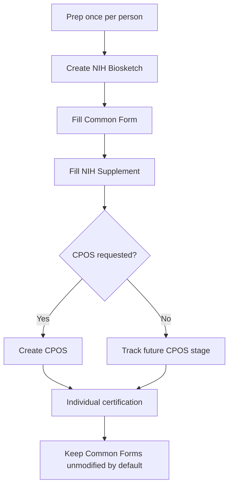

# Complete walkthrough (Biosketch + CPOS)

This page consolidates the end-to-end steps (PI + admin) for both documents.

## 0) Prep (do once per person)

- Confirm **eRA Commons ID**
- Create **ORCID iD**
- Link ORCID in **eRA Commons** (**required**)
- Confirm the same ORCID appears as the **SciENcv PID** (link ORCID in MyNCBI/SciENcv, sign in with ORCID, or manually enter it)
- Clean **My Bibliography** (publications + non-traditional products)
- Add **delegate** (optional)

## 1) Create the NIH Biosketch in SciENcv

Provide a combined biosketch for **every individual listed on the R&R Senior/Key Person Profile (Expanded)**, including every **Other Significant Contributor (OSC)**. See [NIH Common Forms FAQ 57968](https://grants.nih.gov/faqs#/common-forms-biographical-sketch-current-pending-support.htm?anchor=57968) and [FAQ 57969](https://grants.nih.gov/faqs#/common-forms-biographical-sketch-current-pending-support.htm?anchor=57969).

1. MyNCBI → SciENcv → Create New Document
2. Format: NIH Biosketch (Common Form + Supplement)
3. Choose a starting point:
   - ORCID import (fast)
   - Copy from existing SciENcv doc (if you had one)
   - Blank (manual)

### Fill the Common Form

- Identifying information (ensure ORCID appears as PID)
- Professional Preparation
- Appointments and Positions
- Products:
  - Select from **My Bibliography** (preferred)
  - Use ORCID tab only if needed and reconcile back into My Bibliography later
  - Select up to 5 products most closely related to the proposed project and up to 5 other significant products; fewer than 10 is allowed
  - Re-order products so your strongest evidence appears first

### Fill the NIH Supplement

- Personal Statement (3,500 chars)
- Contributions (≤5, 2,000 chars each)
- Honors (≤15)

**How to refer to evidence:** either narrative may point parenthetically to any product selected in the Common Form. NIH suggests lead author/year or PMID/PMCID. Do not insert full bibliographic citations or hyperlinks in the narrative fields.

## 2) Create CPOS in SciENcv (when NIH requests it)

1. Confirm that your **role**, **mechanism**, and **submission stage** actually require CPOS. For many NIH applications, CPOS is requested later (often during **JIT**) rather than attached at initial submission.
2. SciENcv → Create New Document
3. Format: NIH CPOS Common Form
4. Enter active + pending support and required in-kind resources

{: .note }
> Important application-stage exception: **mentored career development** applications require CPOS for **mentor/co-mentor(s)**, not for the candidate.

For JIT, RPPR, and Prior Approval person-level rules, see [Submission lifecycle]({{ site.baseurl }}).

## 3) Certification (individual-only)

- Verify that each senior/key person completed qualifying RST within the 12 months before application submission.
- Each named individual certifies and downloads **each document required for that person and stage**; a delegate cannot certify.
- The biosketch certification includes individual RST and MFTRP attestations as applicable. For RST, the AOR certifies institutional compliance for covered individuals employed by the applicant organization. For MFTRP, the AOR certifies that all identified senior/key personnel were informed of and complied with the individual-certification responsibility.
- Keep each certified SciENcv PDF unmodified unless the Application Guide or NOFO expressly requires a special compiled/flattened attachment.
- For an RPPR, collect the annual MFTRP Section G.1 statement separately from the SciENcv forms.

See [Research-security certifications]({{ site.baseurl }}) for the application and annual RPPR checkpoints.
