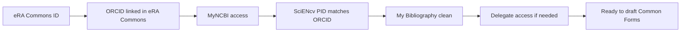

# Getting Ready (accounts + data)

Before you draft narratives or select Products, make sure your identity setup is correct (especially your ORCID link in eRA Commons and the matching ORCID PID in SciENcv), that your MyNCBI/SciENcv account access works, and that My Bibliography is clean.

