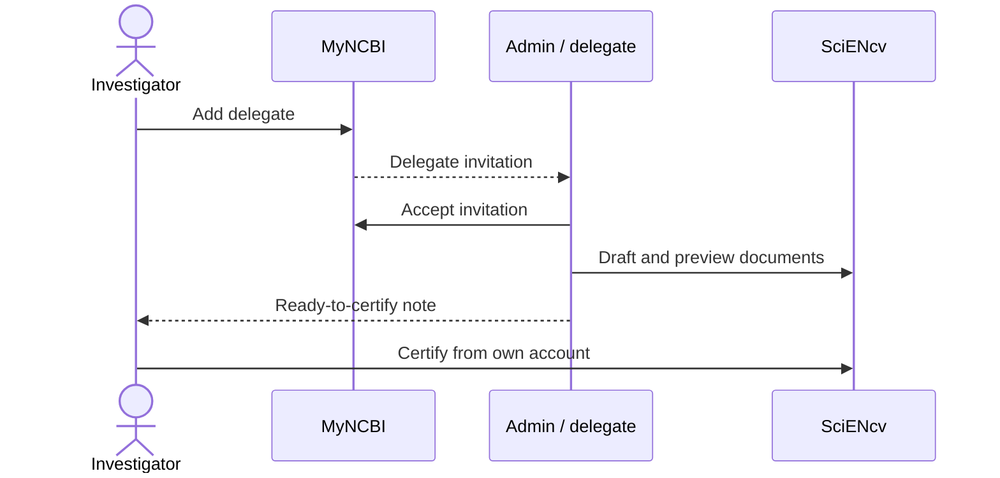

# Delegates (how to collaborate)

## Investigator: add a delegate

MyNCBI → **Account Settings → Delegates → Add delegate** → enter admin email.

## Admin: accept the invite

Log into **your own** MyNCBI account and accept.

## What delegates can and can’t do

Delegates can:
- Create and edit SciENcv documents
- Import data and curate Products
- Paste narratives, format entries, run previews

Delegates cannot:
- **Certify / sign** the final PDFs (the individual named on the form must do this from their own account)

Next: [Certify + download (individual-only step)]({{ site.baseurl }})
