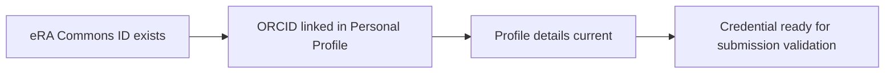

# eRA Commons essentials

- Every senior/key person typically needs an **eRA Commons ID**.
- Link ORCID in **eRA Commons** early.
- Keep your eRA personal profile reasonably current (helps imports and reduces manual fixes).

