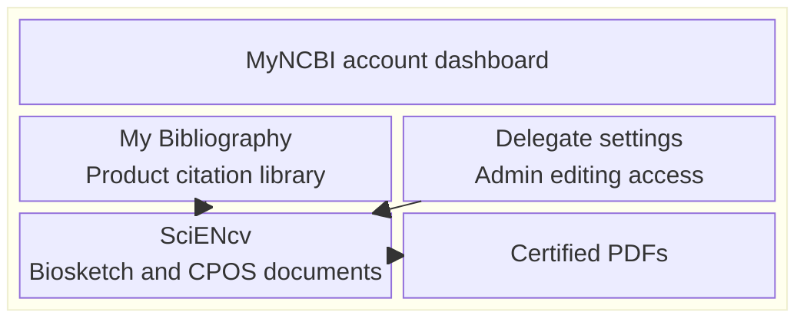

# MyNCBI + SciENcv basics

SciENcv is accessed through **MyNCBI**.

## Where things live

- **MyNCBI**: your NCBI account dashboard
- **SciENcv**: where you build the Common Forms + NIH Supplement
- **My Bibliography**: your citation library used to populate “Products”
- **Delegates**: where a PI grants editing access to an admin

**Diagram summary:** Within MyNCBI, My Bibliography supplies product citations and delegate settings provide editing access for documents built in SciENcv.

