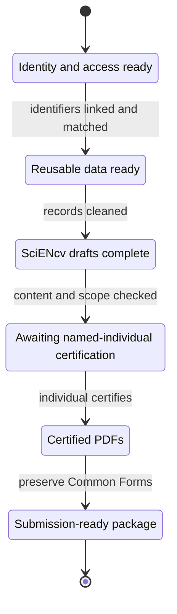

# NIH Common Forms (SciENcv) Playbook

This site is a **PI + admin team** guide to preparing NIH’s required **Common Forms** in **SciENcv**:

- **NIH Biosketch** = *Biographical Sketch Common Form* + *NIH Biographical Sketch Supplement*
- **Current and Pending (Other) Support** = *CPOS Common Form*

Independent guide, not official NIH/NCBI guidance. Verify details in [References]({{ site.baseurl }}).

{: .warning }
> **Current NIH requirements:** Use the applicable SciENcv-generated, digitally certified Common Forms and NIH Biosketch Supplement. eRA system validations stop submissions that do not use compliant forms. Each senior/key person must also meet the current research-security training and MFTRP certification requirements; the applicant organization provides the required institutional certifications through its AOR. See [Policy & Current Requirements]({{ site.baseurl }}).

## Start here (role-based)

- [PI / faculty (15-minute checklist)]({{ site.baseurl }})
- [Administrator / delegate (fast checklist)]({{ site.baseurl }})
- [Co-I / key personnel (fast checklist)]({{ site.baseurl }})

## The two biggest success factors

1. **Identity + data plumbing is correct** (ORCID linked to eRA Commons; ORCID appears as the SciENcv PID; My Bibliography clean).
2. **Workflow timing** accounts for **individual certification** in SciENcv (delegates cannot certify), application RST checks, and annual RPPR MFTRP statements.

## What’s inside

- A fast checklist for each role
- Step-by-step “how-to” pages for SciENcv biosketch and CPOS
- Templates (Personal Statement, Contributions, intake forms, email nudges)
- Troubleshooting and common eRA validation failures
- Curated references (NIH + institutional guides)

Start policy checks with [Research-security certifications]({{ site.baseurl }}) and [Submission lifecycle]({{ site.baseurl }}).
