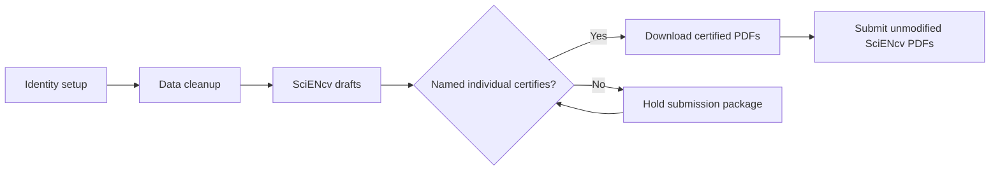

# NIH Common Forms (SciENcv) Playbook (2026)

This site is a **PI + admin team** guide to preparing NIH’s required **Common Forms** in **SciENcv**:

- **NIH Biosketch** = *Biographical Sketch Common Form* + *NIH Biographical Sketch Supplement*
- **Current and Pending (Other) Support** = *CPOS Common Form*

Independent guide, not official NIH/NCBI guidance. Verify details in [References]({{ site.baseurl }}).

{: .warning }
> **Effective date:** NIH requires Common Forms for **applications, JIT, RPPR, and Prior Approval submissions on/after Jan 25, 2026**.
> **Current enforcement status:** For application due dates and JIT, RPPR, and Prior Approval submissions on/after **May 8, 2026**, eRA system validations stop submissions that do not use compliant Common Forms. See **Policy & Timeline**.

## Start here (role-based)

- [PI / faculty (15-minute checklist)]({{ site.baseurl }})
- [Administrator / delegate (fast checklist)]({{ site.baseurl }})
- [Co-I / key personnel (fast checklist)]({{ site.baseurl }})

## The two biggest success factors

1. **Identity + data plumbing is correct** (ORCID linked to eRA Commons; ORCID appears as the SciENcv PID; My Bibliography clean).
2. **Workflow timing** accounts for **individual certification** in SciENcv (delegates cannot certify).

## What’s inside

- A fast checklist for each role
- Step-by-step “how-to” pages for SciENcv biosketch and CPOS
- Templates (Personal Statement, Contributions, intake forms, email nudges)
- Troubleshooting and common eRA validation failures
- Curated references (NIH + institutional guides)
