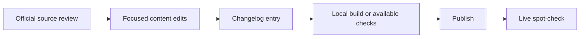

# Maintain & extend this guide

## Recommended operating model

- **One repo, one site**: all guidance in `docs/`
- Use **pull requests** for edits (even if just one maintainer) to preserve history
- Add updates to `Changelog`

## Adding your institution’s SOPs

- Add your local SOP links under:
  - `References`
  - Role-based quickstarts
  - Transition plan

## Quarterly review checklist

At least once per quarter, verify these source-of-truth pages and notices:

- Use the short checklist page: [Quarterly Checklist (Maintainers)]({{ site.baseurl }})

- NIH **Common Forms** hub
- **NOT-OD-26-018** and any newer implementation/FAQ notices
- NIH forms-directory pages for **Biographical Sketch Common Form**, **NIH Biographical Sketch Supplement**, and **CPOS Common Form**
- eRA Commons help for **ORCID**
- NLM Support Center articles for **CPOS XML upload** and **upload errors**
- NIH Application Guide pages that affect **when CPOS is attached at application stage**

After content changes:

- Update `docs/changelog.md`
- Rebuild/redeploy GitHub Pages
- Spot-check the published site (home page, ORCID page, biosketch supplement page, CPOS overview, appendix, and FAQ) to confirm the live site matches the repo

## Screenshot policy

This repo includes **safe SVG placeholders**. Replace with screenshots that your institution is allowed to publish.

