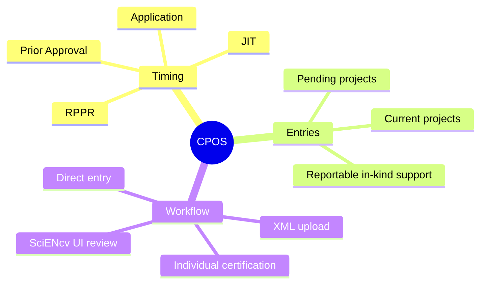

# Current & Pending (Other) Support (CPOS)

This section covers the NIH **Current and Pending (Other) Support (CPOS) Common Form** in SciENcv, including what to report, how to certify, and how to transition from legacy “Other Support” practices.

