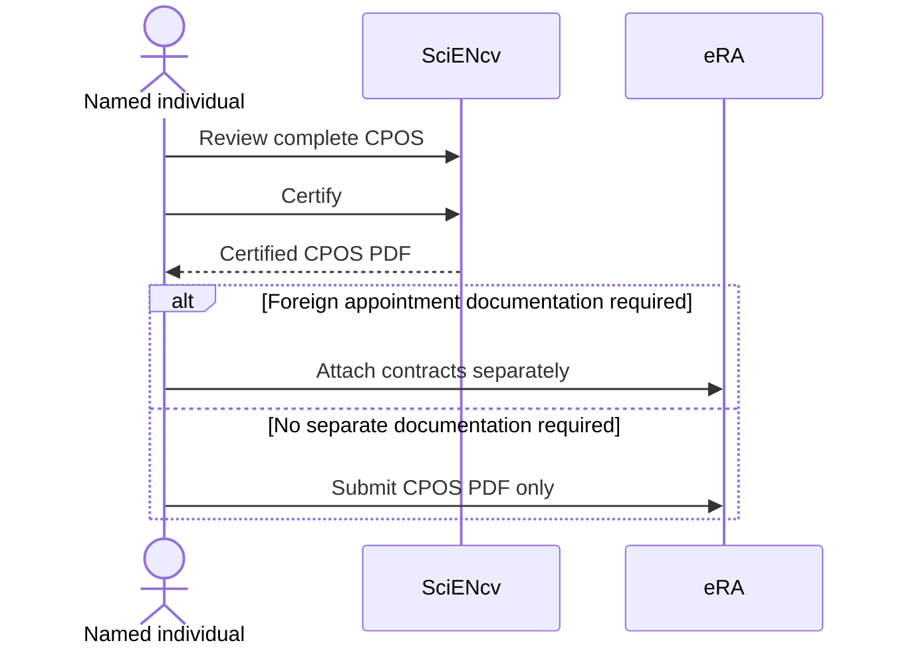

# Certify + download CPOS (individual-only)

When CPOS is required for the person and submission stage, use the same individual-certification pattern as the biosketch:

1. Download PDF
2. The individual named on the CPOS certifies (delegate cannot)
3. Submit SciENcv-generated PDF without modification

{: .warning }
> Keep the certified CPOS PDF unmodified unless the NIH Application Guide or NOFO expressly requires otherwise. Do not print/flatten it merely to combine it with another person’s form or with supporting documentation.

{: .note }
> You **may rename the downloaded PDF file** to match NIH filename guidance, but do **not** alter the PDF content. If the document changes, or if the certification/signature date is more than **12 months** old at submission time, download and **re-certify**.

{: .note }
> If NIH requires **supporting documentation** for foreign appointments/employment reported in CPOS, flatten the contract copies and attach them **separately** in the relevant **eRA JIT, RPPR, or Prior Approval** module. Do **not** append them to the SciENcv CPOS PDF.

{: .note }
> The current CPOS certification text includes RST and MFTRP attestations. For NIH applications due on/after May 25, 2026, NIH collects the individual RST certification through the biosketch because CPOS is ordinarily not collected at application. The annual RPPR MFTRP statement is an additional **separate attachment**, not part of CPOS. See [Research-security certifications]({{ site.baseurl }}).

