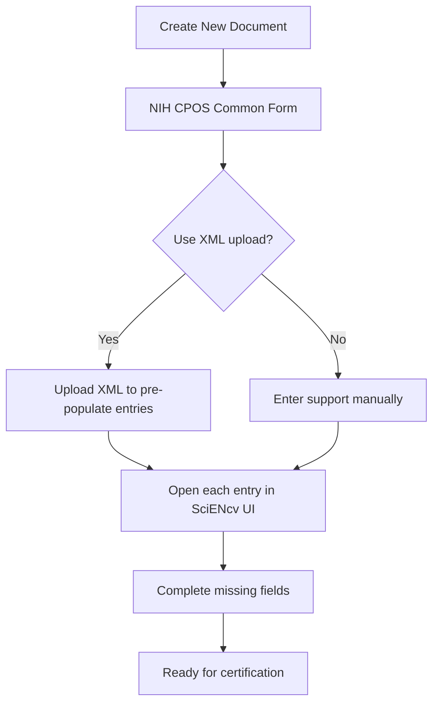

# Create CPOS in SciENcv

1. SciENcv → **Create New Document**
2. Choose format: **NIH Current and Pending (Other) Support (CPOS) Common Form**
3. Populate entries for active + pending support and any required in-kind support

## Optional: seed the document via XML upload

If an administrator can provide an XML file (for example, generated from a prior Other Support document or an institutional database), you can **upload XML to pre-populate the CPOS form** and then complete missing fields in the SciENcv UI.

- See: [XML Upload & Automation]({{ site.baseurl }})

Next: [What to include (practical guidance)]({{ site.baseurl }})
