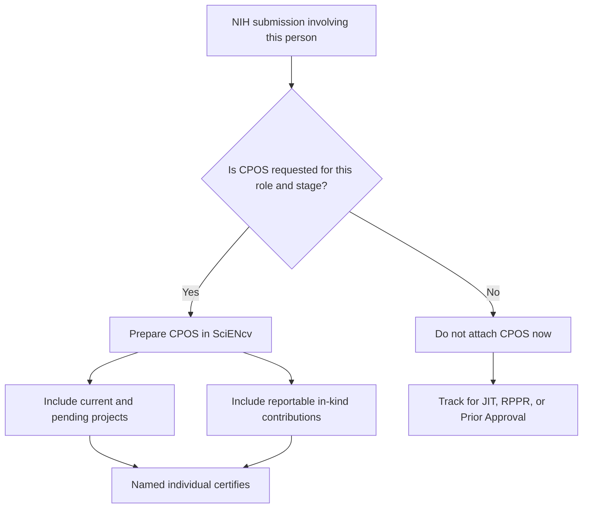

# CPOS Overview

NIH requires a SciENcv-generated **Current and Pending (Other) Support (CPOS) Common Form** for the roles, mechanisms, and lifecycle stages where NIH requests Common Forms / Other Support.

{: .note }
> Do **not** assume CPOS is always attached at application submission. For many NIH applications, current and pending support is requested later in the process (often during **JIT**) or in **RPPR/Prior Approval** workflows. At application stage, follow the **NOFO** and the **NIH Application Guide**. One important application-stage exception: **mentored career development** applications require CPOS for **mentor/co-mentor(s)**, not for the candidate.

For training grants, NIH generally does not specifically request CPOS for Program Directors, training faculty, or other oversight individuals. The current [NIH RPPR Instruction Guide](https://grants.nih.gov/sites/default/files/rppr_instruction_guide.pdf) creates a narrow exception: **new training faculty added in a Training RPPR** are treated as new senior/key personnel and require a biosketch Common Form, NIH Supplement, CPOS, and any applicable supplemental documentation.

Key points:

- Prepare CPOS in **SciENcv** and submit the **certified SciENcv PDF**
- Certification is **individual-only** (delegates cannot certify)
- Disclose **all proposals and active projects** plus **all reportable in-kind contributions**
- Provide a **separate CPOS record for each proposal/active project and each in-kind contribution** (the Common Form instructions call each a separate submission)
- For proposals/active projects, status values are **current** or **pending**
- In-kind contributions are reportable when they are **non-cash contributions from an external entity**, are **not intended for use on the project or proposal for which the disclosure is being submitted**, are valued at **$5,000 or more**, and require a commitment of the individual’s time

{: .note }
> **Separate recipient obligation:** [NIH recipients must provide Other Support disclosure training](https://grants.nih.gov/grants/guide/notice-files/NOT-OD-25-133.html) to all faculty and researchers identified as senior/key personnel, in addition to maintaining a written and enforced disclosure policy. This institutional training requirement is distinct from the individual **Research Security Training (RST)** requirement.

Use the [submission-lifecycle matrix]({{ site.baseurl }}) for JIT authority, RPPR participant changes, annual MFTRP statements, and Change of PD/PI requirements.

