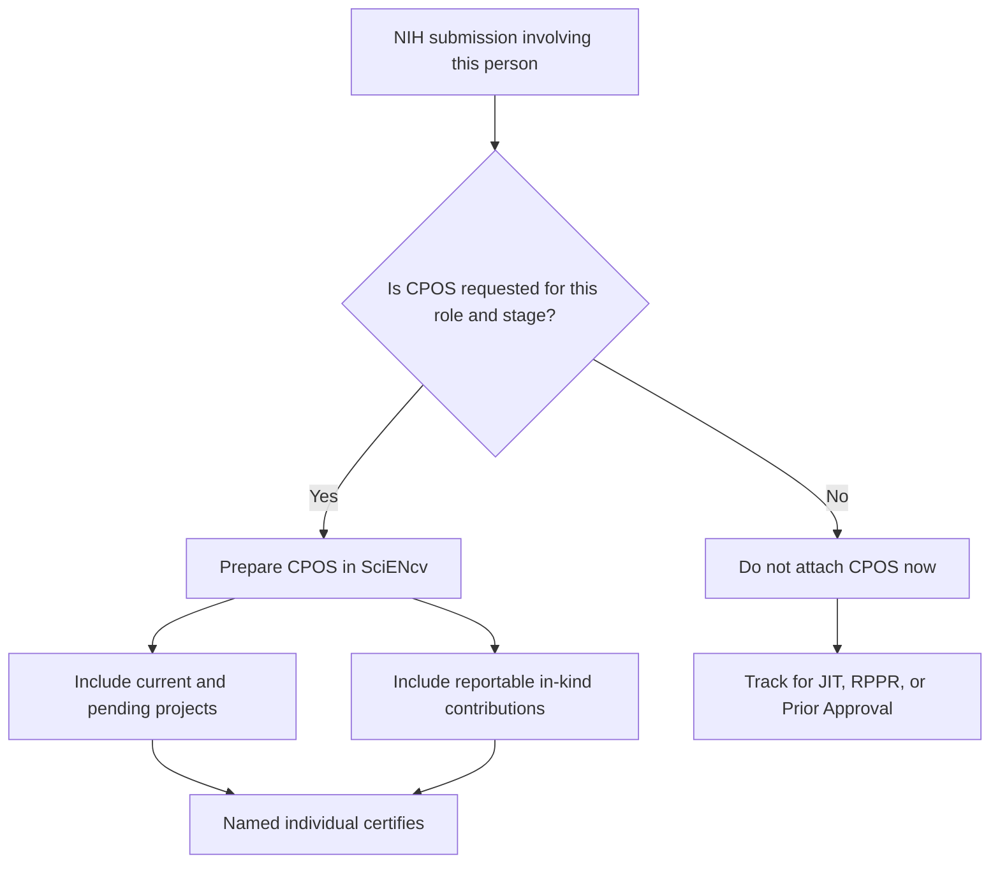

# CPOS Overview

NIH requires a SciENcv-generated **Current and Pending (Other) Support (CPOS) Common Form** for the roles and submission types where NIH requests Common Forms / Other Support.

{: .note }
> Do **not** assume CPOS is always attached at application submission. For many NIH applications, current and pending support is requested later in the process (often during **JIT**) or in **RPPR/Prior Approval** workflows. At application stage, follow the **NOFO** and the **NIH Application Guide**. One important application-stage exception: **mentored career development** applications require CPOS for **mentor/co-mentor(s)**, not for the candidate.

Key points:

- Prepare CPOS in **SciENcv** and submit the **certified SciENcv PDF**
- Certification is **individual-only** (delegates cannot certify)
- Disclose **all proposals and active projects** plus **all reportable in-kind contributions**
- Create a **separate CPOS submission for each proposal/active project and each in-kind contribution**
- For proposals/active projects, status values are **current** or **pending**
- In-kind contributions are reportable when they are **$5,000 or more** **and** require a commitment of the individual’s time

