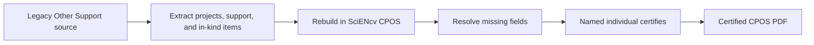

# Transition from the old Other Support format

- The legacy NIH Other Support format remains required for submissions on/before **Jan 24, 2026**.
- For submissions on/after **Jan 25, 2026**, use the SciENcv CPOS Common Form.

Use your prior Other Support document as a source, but rebuild it in SciENcv and certify.

