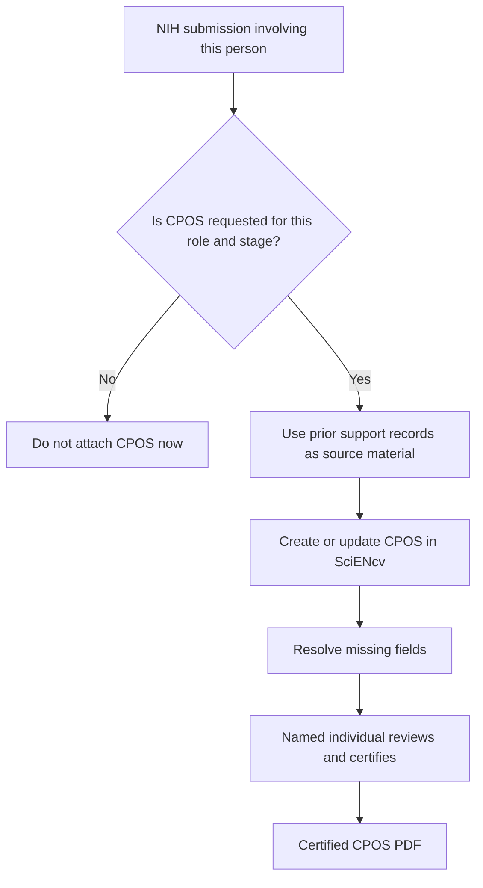

# Reusing prior support records

Prior Other Support documents, spreadsheets, and institutional disclosure records can help populate a CPOS, but they are source material rather than submission-ready forms.

When NIH requests CPOS for the person's role and submission stage:

1. Compare prior records with the current CPOS disclosure categories and instructions.
2. Reconcile projects, in-kind contributions, effort, dates, amounts, and required supporting documentation.
3. Create or update the CPOS in SciENcv and resolve any missing fields.
4. Have the named individual review and certify the final form.

Do not attach CPOS solely because prior support records exist. First confirm the document requirement through the NOFO and applicable application, JIT, RPPR, or Prior Approval instructions. Use the [submission-lifecycle matrix]({{ site.baseurl }}) for the person-and-stage decision.

