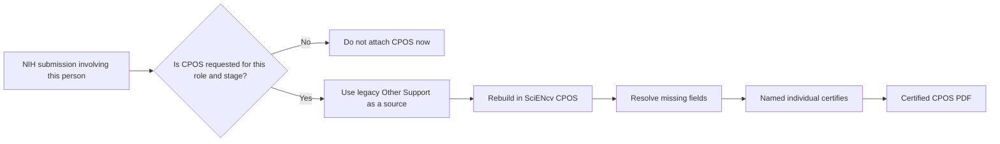

# Transition from the old Other Support format

- When NIH requests Other Support for the person's role and stage, the legacy NIH Other Support format applies to **application due dates** on/before **Jan 24, 2026** and to **JIT, RPPR, or Prior Approval submissions** made on/before that date.
- Use the SciENcv CPOS Common Form for **application due dates** on/after **Jan 25, 2026** and for **JIT, RPPR, or Prior Approval submissions** made on/after that date.

Do not attach CPOS solely because the transition date has passed. First confirm that NIH requests it for the person's role, mechanism, and lifecycle stage under the NOFO and applicable Application Guide, JIT, RPPR, or Prior Approval instructions. When it is requested, use your prior Other Support document as a source, rebuild it in SciENcv, and have the named individual certify it.

