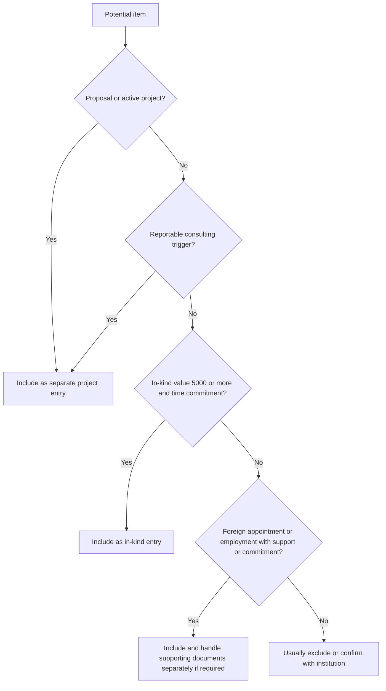

# What to include (practical guidance)

Treat CPOS as a **complete disclosure record** for resources and commitments that NIH says must be reported. Institution policies vary; always confirm with your sponsored programs office.

{: .note }
> Effective **October 1, 2025**, NIH recipients must provide Other Support disclosure training to all faculty and researchers identified as senior/key personnel, in addition to maintaining a written and enforced disclosure policy. Follow your institution's training and disclosure process. This requirement is separate from **Research Security Training (RST)**.

## Include these categories

### 1) All proposals and active projects

Disclose all current and pending proposals/projects that NIH expects in CPOS, including support from domestic and foreign entities. Prepare a **separate entry** for each proposal/active project and for each reportable in-kind contribution.

### 2) Reportable consulting activities

Include consulting under the **proposals / active projects** section when **any** of these NIH triggers apply:

- The consulting activity requires you to **perform research**
- The consulting activity is **not research**, but is related to your research portfolio and could affect **funding, time/effort commitments, or scientific integrity**
- The consulting contract requires you to **conceal or withhold financial or other ties** to the entity

### 3) In-kind contributions

Report in-kind contributions that are **$5,000+** and require a commitment of the individual's time.

### 4) Foreign activities / appointments / employment

Include foreign appointments/employment/affiliations that imply commitment or support under NIH rules. If a foreign appointment and/or employment is reportable in CPOS, remember that **supporting documentation** (copies of contracts specific to those foreign appointments/employment arrangements) is **not appended inside SciENcv**. NIH says to attach that documentation **separately** in the relevant **eRA JIT, RPPR, or Prior Approval** module, with **translations** if the contract is not in English. The supporting-documentation requirement excludes **personal service contracts** and **employment contracts for fellows supported by foreign entities**; that exclusion does not by itself remove an otherwise reportable relationship from CPOS.

{: .note }
> **Related but separate:** NIH's [May 27, 2026 reminder](https://grants.nih.gov/grants/guide/notice-files/NOT-OD-26-084.html) did not change the CPOS categories or expand the foreign-component definition. NIH says **most instances of foreign co-authorship represent a foreign component**, although minor or indirect contributions may not. In **all cases**, recipients should report foreign co-authorship to the funding NIH Institute or Center **as soon as they become aware of it** so NIH can determine what steps, if any, are needed. As a practical workflow, route the matter through institutional review and the funding IC even when no CPOS entry is required; separately disclose any support, resource, appointment, affiliation, or commitment that NIH requires in CPOS.

## Usually exclude these categories

- Broadly available institutional core facilities or shared equipment
- **Training awards**
- **Prizes**
- **Gifts**
- Personal information such as home address, personal phone, personal email, marital status, hobbies, or similar non-research data

Admin intake template:
- [Other Support (CPOS) intake form (admin worksheet)]({{ site.baseurl }})

If you are converting legacy Other Support documents at scale, see: 
- [XML Upload & Automation]({{ site.baseurl }})

