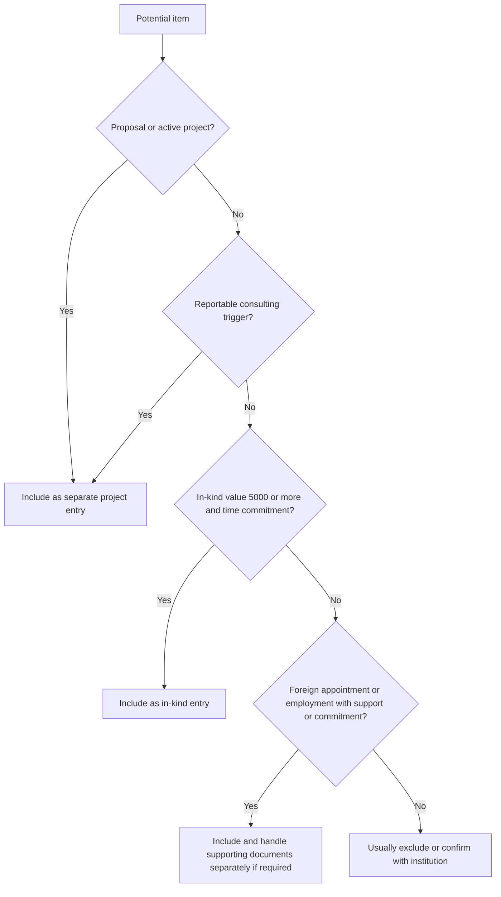

# What to include (practical guidance)

Treat CPOS as a **complete disclosure record** for resources and commitments that NIH says must be reported. Institution policies vary; always confirm with your sponsored programs office.

## Include these categories

### 1) All proposals and active projects

Disclose all current and pending proposals/projects that NIH expects in CPOS, including support from domestic and foreign entities. Prepare a **separate entry** for each proposal/active project and for each reportable in-kind contribution.

### 2) Reportable consulting activities

Include consulting under the **proposals / active projects** section when **any** of these NIH triggers apply:

- The consulting activity requires you to **perform research**
- The consulting activity is **not research**, but is related to your research portfolio and could affect **funding, time/effort commitments, or scientific integrity**
- The consulting contract requires you to **conceal or withhold financial or other ties** to the entity

### 3) In-kind contributions

Report in-kind contributions that are **$5,000+** and require a commitment of the individual's time.

### 4) Foreign activities / appointments / employment

Include foreign appointments/employment/affiliations that imply commitment or support under NIH rules. If a foreign appointment and/or employment is reportable in CPOS, remember that **supporting documentation** (copies of contracts specific to those foreign appointments/employment arrangements) is **not appended inside SciENcv**. NIH says to attach that documentation **separately** in the relevant **eRA JIT, RPPR, or Prior Approval** module, with **translations** if the contract is not in English.

## Usually exclude these categories

- Broadly available institutional core facilities or shared equipment
- **Training awards**
- **Prizes**
- **Gifts**
- Personal information such as home address, personal phone, personal email, marital status, hobbies, or similar non-research data

Admin intake template:
- [Other Support (CPOS) intake form (admin worksheet)]({{ site.baseurl }})

If you are converting legacy Other Support documents at scale, see: 
- [XML Upload & Automation]({{ site.baseurl }})

