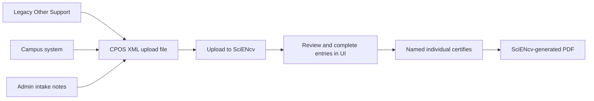

# XML Upload & Automation

SciENcv includes **Data Ingest (XML file upload)** for the **Current and Pending (Other) Support (CPOS) Common Form**. This capability is especially useful when a grants office wants to pre-populate a PI’s CPOS entries from:

- A legacy “Other Support” Word/PDF
- A campus system (e.g., internal grants database)
- Prior SciENcv exports
- Admin-collected intake notes

**Important:** XML upload is a *data-entry accelerator*, not a submission bypass. NIH still requires a **SciENcv-generated, digitally certified PDF**, and certification is done by the individual (not a delegate).

