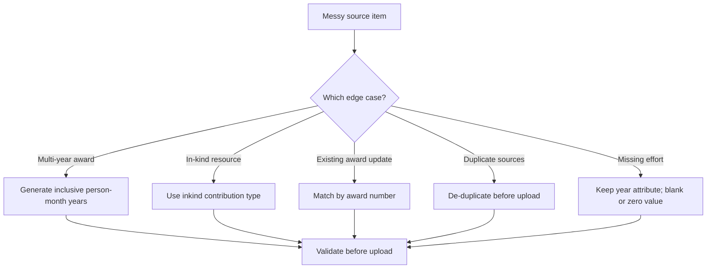

# Examples + edge cases



## Example 1: Multi-year award with a single annual effort value

**Input (messy):**

> New pending R01, title ... start 07/2026 end 06/2030, ... effort 1.2 calendar months per year, amount $1,200,000, overlap none.

**Expected XML pattern:**
- `supporttype` = `pending`
- `contributiontype` = `award`
- `startdate` = `2026-07-01`
- `enddate` = `2030-06-01`
- `<personmonth year="2026">1.2</personmonth>` through `2030` (inclusive)

## Example 2: In-kind computing resource with unknown end date

**Input:**

> Current in-kind: HPC cluster access (est. $30,000/year), received 10/2025, effort not known yet.

**Expected XML pattern:**
- `contributiontype` = `inkind`
- `supporttype` = `current`
- `projecttitle` and `awardnumber` can be empty
- `inkinddescription` describes the resource
- Emit `<personmonth year="2025"></personmonth>` even if effort is blank

## Example 3: Updating an existing entry by award number

**Update instruction:**

> Change award number R01 AA123456 title to "Revised Title" and note that the project ended before the CPOS snapshot date.

**Expected behavior:**
- Find the entry with matching `<awardnumber>`
- Overwrite the `<projecttitle>`
- Do **not** invent a `completed` status (valid values are only `current` or `pending`)
- If the project is no longer current or pending as of the CPOS reporting date, **remove it from the CPOS upload** rather than changing `supporttype`

## Example 4: Duplicate entries from merged sources

If both the PI and admin provide the same support item in PART 1, de-duplication should collapse them into one entry using:
- `awardnumber` (preferred)
- else `projecttitle + supportsource + startdate`

## Example 5: Missing effort

SciENcv can accept a file where effort values are blank, but **the year must still be present**. If the effort is truly zero, use `0`; if it is unknown or not ready for upload, leave the value blank and resolve it in SciENcv.

```xml
<commitment>
  <personmonth year="2025">0</personmonth>
  <personmonth year="2026"></personmonth>
  <personmonth year="2027"></personmonth>
</commitment>
```

## Example 6: Full XML file (dummy data)

This is a complete, valid file using the simple upload template with one award entry.

```xml
<?xml version="1.0" encoding="utf-8"?>
<profile>
  <identification>
    <id idtype="orcid">0000-0002-1825-0097</id>
    <account accounttype="eRA-Commons">JDOE1</account>
    <name current="yes">
      <firstname>Jane</firstname>
      <middlename>Marie</middlename>
      <lastname>Doe</lastname>
    </name>
  </identification>
  <employment>
    <position featured="true" current="yes">
      <positiontitle>Senior Researcher</positiontitle>
      <organization>
        <orgname>Science &amp; Technology Inst</orgname>
        <city>Ann Arbor</city>
        <stateorprovince>MI</stateorprovince>
        <country>USA</country>
      </organization>
      <startdate><year>2015</year></startdate>
    </position>
  </employment>
  <funding>
    <support>
      <projecttitle>Advanced Study of Polymer Dynamics</projecttitle>
      <awardnumber>NSF-2024-5589</awardnumber>
      <supportsource>National Science Foundation</supportsource>
      <location>University of Michigan</location>
      <contributiontype>award</contributiontype>
      <awardamount>150000</awardamount>
      <inkinddescription>None</inkinddescription>
      <overallobjectives>To investigate the long-term stability of biodegradable plastics.</overallobjectives>
      <potentialoverlap>None.</potentialoverlap>
      <startdate>2024-01-01</startdate>
      <enddate>2025-12-31</enddate>
      <supporttype>current</supporttype>
      <commitment>
        <personmonth year="2024">3.5</personmonth>
        <personmonth year="2025">3.5</personmonth>
      </commitment>
    </support>
  </funding>
</profile>
```
