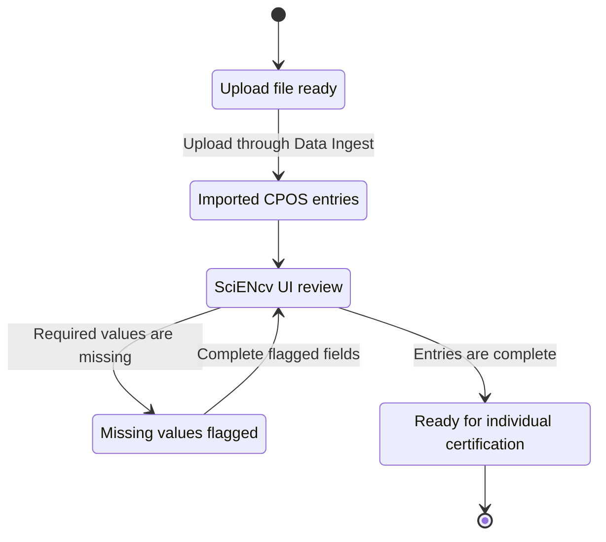
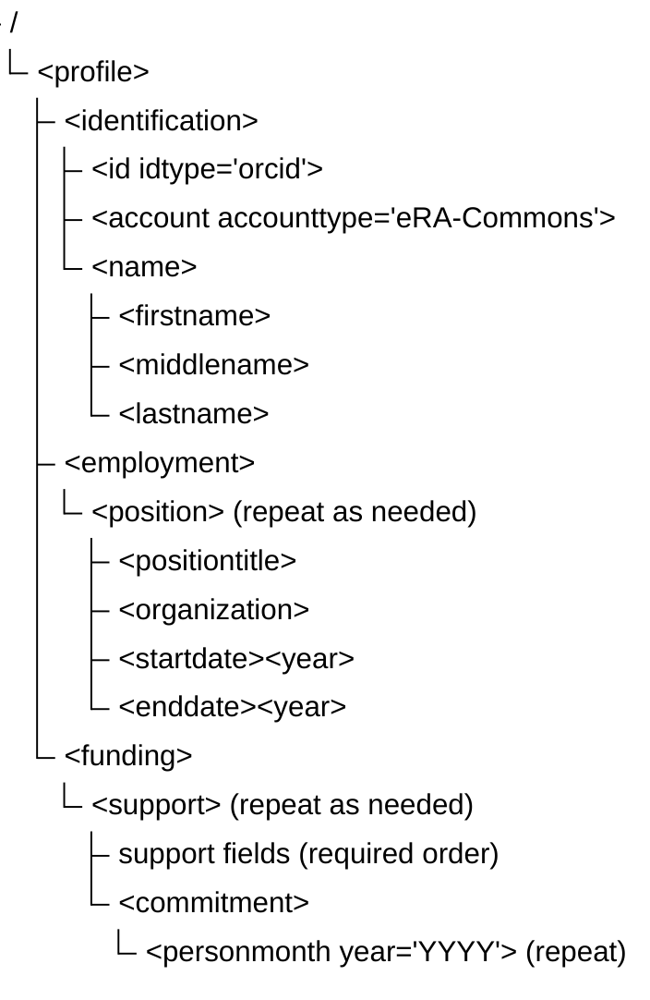

# Overview (what XML upload is)

SciENcv supports **Data Ingest (XML file upload)** to help users pre-populate CPOS entries in the SciENcv interface.

{: .warning }
> XML upload is a data-entry accelerator, not a submission bypass. NIH still requires a **SciENcv-generated, digitally certified PDF**, and the individual (not a delegate) must certify.

{: .note }
> A file can still be a *valid upload file* even when some fields are blank. After upload, SciENcv will flag missing required values in the UI with red exclamation icons that must be resolved before certification/download.

{: .note }
> SciENcv allows **zero person-month effort** when it is accurate for a particular year. A reportable in-kind contribution must still have an associated commitment of the individual's time overall.

{: .note }
> The CPOS form displays dates in a human-facing month/year style, but the XML upload template uses machine-readable `YYYY-MM-DD`. If you know month/year, use day `01` consistently and confirm the rendered entry after upload. If you know only the year, do not invent a month; leave the date unresolved and complete it in SciENcv after checking the source.

## Where to find XML upload in SciENcv

Use **Create New Document → Current and Pending (Other) Support (CPOS) Common Form** to access the XML upload flow.

## Two upload rules that commonly break files

- `<contributiontype>` must be present and non-empty. Use `award` for proposals/active projects and `inkind` for in-kind contributions.
- In `<commitment>`, each `<personmonth>` must include a `year="YYYY"` attribute even if the value is blank.

## Element reference (simple upload template)

Use this quick reference for the CPOS upload fields and limits.

| Element | Description | Type / limits |
| --- | --- | --- |
| firstname | User first name (in `<name>`) | String (no max limit) |
| middlename | User middle name (in `<name>`) | String (no max limit) |
| lastname | User family name (in `<name>`) | String (no max limit) |
| positiontitle | Position title | String (no max limit) |
| orgname | Organization name | String (no max limit) |
| city | City of organization | String (no max limit) |
| stateorprovince | State or province | String (no max limit) |
| country | Country | String (no max limit) |
| startdate/year | Employment start year in `<startdate><year>YYYY</year></startdate>` | YYYY |
| enddate/year | Employment end year in `<enddate><year>YYYY</year></enddate>` | YYYY |
| projecttitle | Proposals and active projects title | String, 300 chars max |
| awardnumber | Proposals and active award number | String, 50 chars max |
| supportsource | Source of support | String, 60 chars max |
| location | Primary place of performance | String, 60 chars max |
| contributiontype | Used to route to award vs in-kind | `award` or `inkind` (required) |
| awardamount | US-dollar amount associated with the support entry; interpretation depends on `contributiontype` | Integer, 13 digits max; nearest dollar |
| inkinddescription | Summary of in-kind contribution | String, 500 chars max |
| overallobjectives | Overall objectives | String, 1500 chars max |
| potentialoverlap | Statement of potential overlap | String, 5000 chars max |
| startdate | Project start date or in-kind receipt date | Valid calendar date in YYYY-MM-DD |
| enddate | Project end date | Valid calendar date in YYYY-MM-DD |
| supporttype | Status of support | `current` or `pending` |
| personmonth | Person-months per year in `<commitment>` | `0` through `12`, with up to two decimal places; blank may be used for upload triage |

For proposals and active projects, `<awardamount>` is the total amount for the entire performance period, including indirect costs, rounded to the nearest dollar. Convert foreign currency to US dollars at submission and use a reasonable estimate when an exact value is not readily ascertainable. For a consortium/contractual arrangement or multi-project award, use the overall project's award number and support source, but enter the subproject's title, amount, person-months, and other details—not the overall project's full amount.

For in-kind contributions, `<awardamount>` is the estimated contribution value in US dollars, rounded to the nearest dollar. Report only **non-cash contributions provided by an external entity** that are **not intended for use on the project or proposal for which the disclosure is being submitted**, are valued at **$5,000 or more**, and require a commitment of the individual's time. Put resources intended for that project or proposal in **Facilities & Other Resources** or **Equipment**, as applicable, and exclude broadly available institutional cores or shared equipment. Blank upload values must be resolved in SciENcv before certification.

## Character restrictions

Escape reserved XML characters in element text:
- `&` -> `&amp;`
- `<` -> `&lt;`
- `>` -> `&gt;`

Next:
- [AI-assisted CPOS XML generator prompt]({{ site.baseurl }})
- [Quality control + validation checklist]({{ site.baseurl }})
