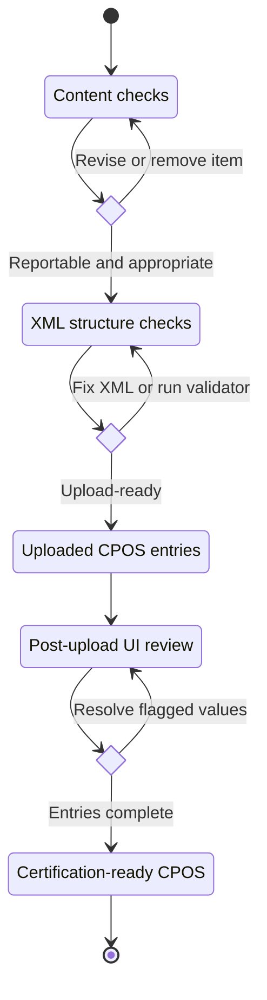

# Quality control + validation checklist

Use this checklist before uploading to SciENcv, and again before final certification by the named individual.

## 1) Content checks (policy-driven)

- **No personal information**: do not include home address, personal phone numbers, personal email, etc.
- Ensure each award or in-kind resource reflects **actual commitments and resources**.
- For *consulting*, confirm whether it meets the Common Form disclosure triggers and (if so) treat it as an `award` entry under proposals/active projects.
- For *in-kind contributions*, confirm the item is a non-cash contribution from an external entity, is not intended for use on the project or proposal for which the disclosure is being submitted, meets the $5,000 threshold, and includes a time commitment. Route resources intended for that project or proposal to Facilities & Other Resources or Equipment, as applicable, and exclude broadly available institutional cores or shared equipment.

## 2) Structure checks (upload-driven)

- Root element is exactly `<profile>` with no attributes.
- Exactly one `<funding>` block.
- Every `<support>` entry includes a non-empty `<contributiontype>` set to `award` or `inkind`.
- Dates are real calendar dates in `YYYY-MM-DD` (use day `01` if you only have month/year; do not invent a month or day for a year-only source).
- Award amounts are digits only (no `$`, no commas).
- Each `<personmonth>` has a 4-digit `year` attribute.
- Person-month values may be blank for upload triage; populated values must be from `0` through `12` with no more than two decimal places. If effort is truly zero, use `0` and confirm the value in the SciENcv UI.

## 3) Post-upload checks (SciENcv UI)

After uploading:

- Open each entry in the SciENcv CPOS UI.
- Resolve any red exclamation icons for missing required fields.
- Confirm that effort and overlap text display as expected.

## Optional: run the lightweight validator in this repo

This repo includes a browser-based tool and a CLI script to catch common formatting issues:

- Browser tool: [Open the validator]({{ site.baseurl }}/tools/) and drag/drop your XML.
- CLI script:

```bash
python tools/validate_cpos_xml.py path/to/your_cpos.xml
```

Both checks cover:
- XML well-formedness
- missing/invalid `<contributiontype>`
- real calendar dates
- award amount formatting
- person-month years, numeric values, range, and decimal precision

It does not perform full XSD validation (SciENcv is the source of truth).


