# Browser XML validator

Use this tool to check for the most common CPOS XML upload issues before SciENcv.
It runs entirely in your browser; files are not uploaded anywhere.

[Open the browser-based validator]({{ site.baseurl }}/tools/)

If you prefer a command-line check, see the script in `tools/validate_cpos_xml.py`.

```mermaid
stateDiagram-v2
    direction TB
    accTitle: Browser validator workflow
    accDescr: XML is checked locally in the browser. Reported issues return the file for correction and another check; a clean result proceeds to upload and review in SciENcv.
    state "XML loaded or pasted" as Loaded
    state "Browser validation complete" as Checked
    state Result <<choice>>
    state "Ready to upload" as UploadReady
    state "SciENcv UI review" as Review
    [*] --> Loaded
    Loaded --> Checked: Run browser validation
    Checked --> Result
    Result --> Loaded: Issues found - fix XML
    Result --> UploadReady: No issues found
    UploadReady --> Review: Upload to SciENcv
    Review --> [*]
```

