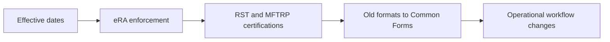

# Policy & Timeline

This section summarizes NIH’s implementation dates, eRA validation behavior, research-security certifications, and the high-level differences between the legacy NIH biosketch/other support formats and the 2026 Common Forms.

Start with the [effective-date timeline]({{ site.baseurl }}), then use the [research-security certification guide]({{ site.baseurl }}) to distinguish application and annual RPPR requirements.
