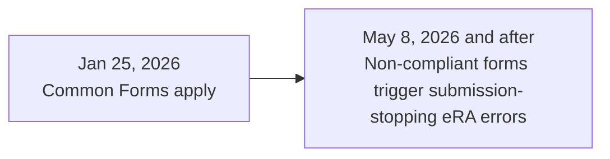

# Effective dates (NIH)

NIH implemented the **Common Forms** framework for:

- **Application due dates** on/after **Jan 25, 2026**
- **JIT, RPPR, Prior Approval submissions** on/after **Jan 25, 2026**

For application due dates and JIT, RPPR, and Prior Approval submissions on/after **May 8, 2026**, eRA system validations stop submissions that do not use compliant Common Forms.

See the NIH Common Forms hub and the Guide Notice for the full matrix of scenarios:
- [NIH Common Forms hub](https://grants.nih.gov/policy-and-compliance/implementation-of-new-initiatives-and-policies/common-forms-for-biosketch)
- [NOT-OD-26-018](https://grants.nih.gov/grants/guide/notice-files/NOT-OD-26-018.html)
- [NOT-OD-26-079](https://grants.nih.gov/grants/guide/notice-files/NOT-OD-26-079.html)
