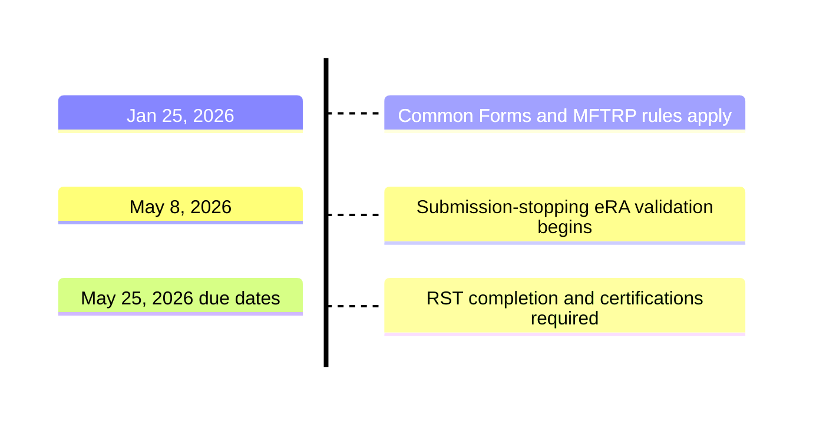

# Current NIH requirements

NIH requires the applicable **Common Forms** for applications and for JIT, RPPR, and Prior Approval workflows. When a biosketch is required, it consists of the Biographical Sketch Common Form and NIH Biosketch Supplement. Use the current NIH instructions and submission-stage rules to determine which documents are required for each person.

## Requirements at a glance

- Create each required Biosketch or CPOS document in **SciENcv**.
- Use an **ORCID iD** as the form's PID and ensure it matches the ORCID linked to the individual's eRA Commons profile.
- Have the **named individual** review and digitally certify each form. Delegates may help prepare a document but cannot certify it.
- Keep certified SciENcv PDFs unmodified unless NIH expressly requires a special compiled or flattened attachment.
- Expect eRA system validations to stop a submission that uses a non-SciENcv, uncertified, or otherwise noncompliant form.
- Request CPOS only when the NOFO or applicable application, JIT, RPPR, or Prior Approval instructions require it for that person's role and submission stage.

## Current research-security requirements

- Each senior/key person must complete qualifying research security training within the **12 months before application submission** and certify completion through the SciENcv biosketch. Through its AOR, the applicant organization separately certifies compliance for covered individuals it employs.
- A person who is currently party to a malign foreign talent recruitment program (MFTRP) is ineligible to serve as senior/key personnel on an NIH grant or cooperative agreement.
- Individual MFTRP certification is part of the SciENcv biosketch. Annual RPPRs also require the prescribed person-level MFTRP statements in Section G.1.

**Timeline summary:** Common Forms and MFTRP rules have applied since **January 25, 2026**; submission-stopping eRA validation began **May 8, 2026**; and the application RST completion and certification requirements apply to due dates on or after **May 25, 2026**.

Use these official NIH sources for the controlling requirements:

- [NIH Common Forms hub](https://grants.nih.gov/policy-and-compliance/implementation-of-new-initiatives-and-policies/common-forms-for-biosketch)
- [NOT-OD-26-018](https://grants.nih.gov/grants/guide/notice-files/NOT-OD-26-018.html)
- [NOT-OD-26-079](https://grants.nih.gov/grants/guide/notice-files/NOT-OD-26-079.html)
- [NOT-OD-26-017](https://grants.nih.gov/grants/guide/notice-files/NOT-OD-26-017.html)

Next: [Research-security certifications]({{ site.baseurl }})
