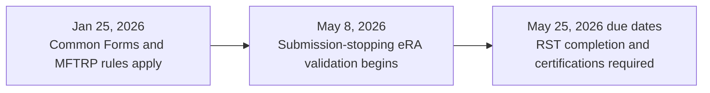

# Effective dates (NIH)

NIH implemented the **Common Forms** framework for:

- **Application due dates** on/after **Jan 25, 2026**
- **JIT, RPPR, Prior Approval submissions** on/after **Jan 25, 2026**

NIH allowed a transition period through **May 7, 2026**. For application due dates and JIT, RPPR, and Prior Approval submissions on/after **May 8, 2026**, eRA system validations stop submissions that do not use compliant Common Forms.

Two related research-security dates also affect the workflow:

- Effective **Jan 25, 2026**, a person who is currently party to a malign foreign talent recruitment program (MFTRP) is ineligible to serve as senior/key personnel on an NIH grant or cooperative agreement. Application and annual RPPR certification requirements also apply.
- For application due dates on/after **May 25, 2026**, each senior/key person must have completed research security training (RST) within the **12 months before application submission** and must certify completion through the SciENcv biosketch. Through the AOR, the applicant organization provides a separate institutional certification for covered individuals it employs.

See the NIH Common Forms hub and the Guide Notice for the full matrix of scenarios:
- [NIH Common Forms hub](https://grants.nih.gov/policy-and-compliance/implementation-of-new-initiatives-and-policies/common-forms-for-biosketch)
- [NOT-OD-26-018](https://grants.nih.gov/grants/guide/notice-files/NOT-OD-26-018.html)
- [NOT-OD-26-079](https://grants.nih.gov/grants/guide/notice-files/NOT-OD-26-079.html)
- [NOT-OD-26-017](https://grants.nih.gov/grants/guide/notice-files/NOT-OD-26-017.html)

Next: [Research-security certifications]({{ site.baseurl }})
