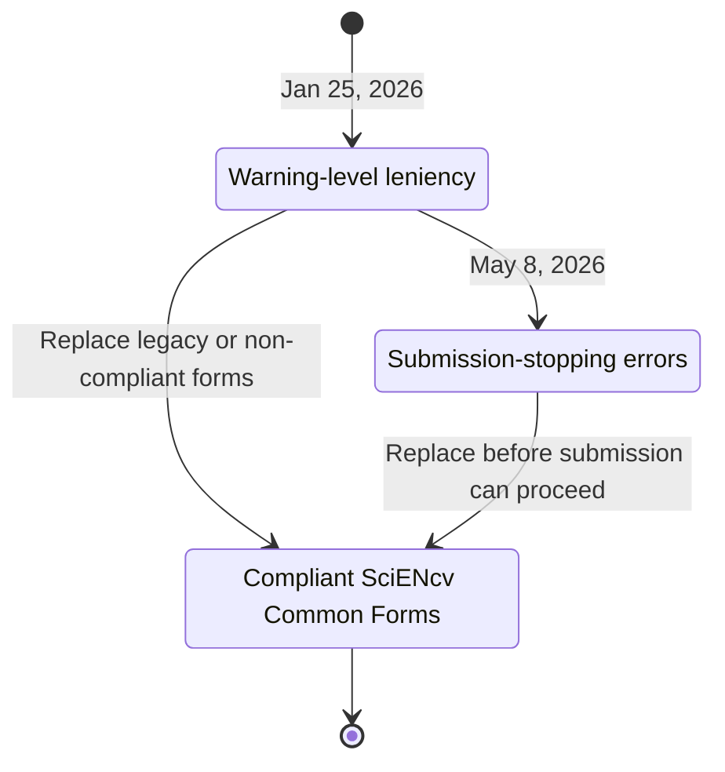

# Enforcement (active NIH timeline)

NIH enforces Common Forms via **eRA system validations**:

- **Common Forms are required** for applications, JIT, RPPR, and Prior Approval submissions on/after **Jan 25, 2026**.
- NIH's warning-only leniency period ended **May 7, 2026**.
- As of **May 8, 2026**, system validations stop submissions not using compliant Common Forms.
- Historical note: through **May 7, 2026**, NIH said submissions containing legacy NIH biosketch/other support pages or non-compliant Common Forms received warnings and were not withdrawn for that issue.

See NIH notices [NOT-OD-26-018](https://grants.nih.gov/grants/guide/notice-files/NOT-OD-26-018.html), [NOT-OD-26-033](https://grants.nih.gov/grants/guide/notice-files/NOT-OD-26-033.html), and [NOT-OD-26-079](https://grants.nih.gov/grants/guide/notice-files/NOT-OD-26-079.html).

{: .warning }
> **Operational implication:** you need dedicated **individual certification steps** in your internal submission timeline. Delegates cannot certify for the named individual.
