# Enforcement (current)

NIH enforces Common Forms via **eRA system validations**:

- **Common Forms are required** for applicable applications and JIT, RPPR, and Prior Approval submissions.
- System validations stop submissions that do not use compliant Common Forms.
- The practical fix for an eRA Common Forms error is usually to replace the attachment with a compliant, digitally certified SciENcv PDF and confirm that its ORCID PID matches the ORCID linked to the eRA Commons credential used in the submission.

```mermaid
stateDiagram-v2
    accTitle: eRA Common Forms validation and correction loop
    accDescr: eRA validates submitted Common Forms. Compliant forms pass; noncompliant forms block submission until the attachment is replaced and revalidated.
    state "eRA validates Common Forms" as Validate
    state ComplianceCheck <<choice>>
    state "Submission blocked" as Blocked
    state "Replace with compliant, certified SciENcv PDF" as Replace
    state "Submission proceeds" as Proceed
    [*] --> Validate: Submit package
    Validate --> ComplianceCheck
    ComplianceCheck --> Proceed: Compliant
    ComplianceCheck --> Blocked: Form error
    Blocked --> Replace: Correct attachment
    Replace --> Validate: Revalidate
    Proceed --> [*]
```

See NIH notices [NOT-OD-26-018](https://grants.nih.gov/grants/guide/notice-files/NOT-OD-26-018.html) and [NOT-OD-26-079](https://grants.nih.gov/grants/guide/notice-files/NOT-OD-26-079.html).

{: .warning }
> **Operational implication:** you need dedicated **individual certification steps** in your internal submission timeline. Delegates cannot certify for the named individual.

{: .note }
> **PDF handling:** keep each certified SciENcv Common Form unmodified unless the NIH Application Guide or NOFO expressly instructs otherwise. NIH’s participating-faculty biosketch attachment is one such exception: individually certified biosketches are combined and flattened for that specific attachment. Foreign appointment/employment contracts and annual MFTRP statements are separate flattened attachments, not edits to the SciENcv Common Form.

See [Submission lifecycle: application, JIT, RPPR, and Prior Approval]({{ site.baseurl }}) for person-level attachment rules and exceptions.
