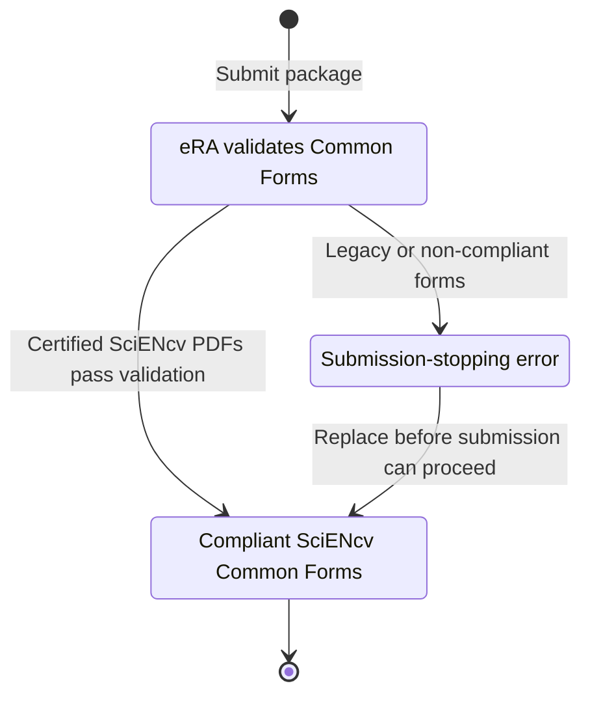

# Enforcement (active NIH timeline)

NIH enforces Common Forms via **eRA system validations**:

- **Common Forms are required** for applications, JIT, RPPR, and Prior Approval submissions on/after **Jan 25, 2026**.
- For application due dates and JIT, RPPR, and Prior Approval submissions on/after **May 8, 2026**, system validations stop submissions not using compliant Common Forms.
- The practical fix for an eRA Common Forms error is to replace the attachment with a compliant, digitally certified SciENcv PDF.

See NIH notices [NOT-OD-26-018](https://grants.nih.gov/grants/guide/notice-files/NOT-OD-26-018.html) and [NOT-OD-26-079](https://grants.nih.gov/grants/guide/notice-files/NOT-OD-26-079.html).

{: .warning }
> **Operational implication:** you need dedicated **individual certification steps** in your internal submission timeline. Delegates cannot certify for the named individual.
