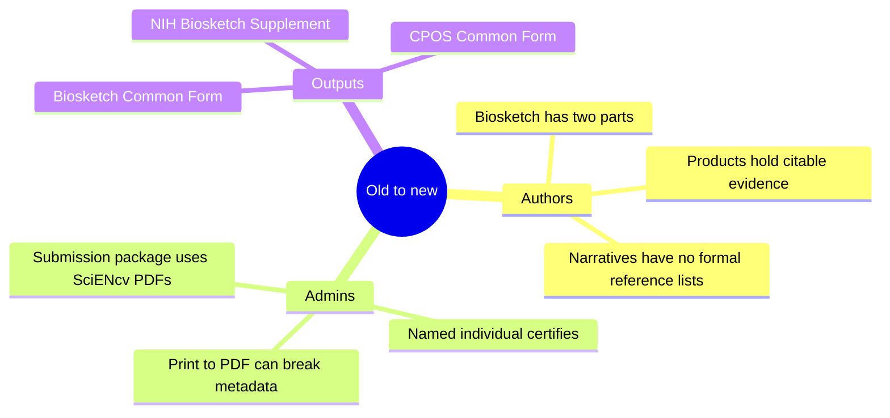

# What changed (old → new) — minimal but practical

**Key differences for authors:**

- **Biosketch becomes two parts:** Common Form + NIH Supplement
- **No formal citations/reference lists inside narratives:** Personal Statement and Contributions use informal product references; citable items live in **Products** (10 total).
- **Digital certification:** PDFs must be generated and certified in SciENcv.

**Key differences for admins:**

- You can help write and curate—but the **named individual must certify**.
- “Print to PDF” breaks machine-readable metadata and can trigger submission rejection.

Next: [Biosketch overview (what you’re producing)]({{ site.baseurl }})
