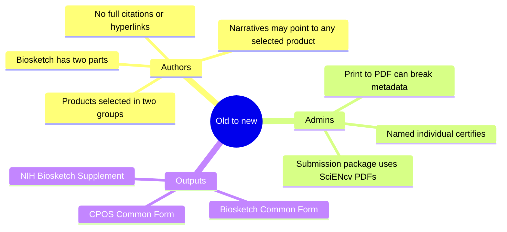

# What changed (old → new) — minimal but practical

**Key differences for authors:**

- **Biosketch becomes two parts:** Common Form + NIH Supplement
- **Products are selected in two groups:** up to 5 products most closely related to the proposed project and up to 5 other significant products. Fewer than 10 may be selected.
- **Narratives use brief product references, not full citations:** the Personal Statement and Contributions may refer parenthetically to any selected product, preferably by lead author/year or PMID/PMCID. Do not insert full bibliographic citations or hyperlinks.
- **Digital certification:** PDFs must be generated and certified in SciENcv.

**Key differences for admins:**

- You can help write and curate—but the **named individual must certify**.
- “Print to PDF” breaks machine-readable metadata and can trigger submission rejection. Keep certified SciENcv PDFs unmodified except where NIH instructions expressly require a special compiled/flattened attachment.

Next: [Biosketch overview (what you’re producing)]({{ site.baseurl }})
