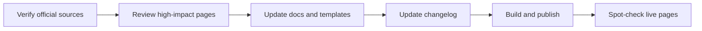

# Quarterly Checklist (Maintainers)

Use this once per quarter to keep the playbook aligned with current NIH/eRA guidance.

## 1) Verify source-of-truth pages

- Check the NIH **Common Forms hub** and all Guide Notices newer than **NOT-OD-26-079** for effective-date or validation changes.
- Compare the forms-directory pages with the **direct final Biosketch, Supplement, and CPOS PDFs**. Confirm the up-to-5 + up-to-5 Product limits and the parenthetical narrative-reference rule have not changed.
- Check the OMB lines on the two Common Forms and the NIH Supplement. The two Common Forms presently display **3145-0279 / Oct 31, 2026**; the Supplement displays **0925-0001 / Dec 31, 2027** and **0925-0002 / Nov 30, 2027**. Treat an approaching date as a prompt to look for replacement instructions, not as an automatic form-invalidity date.
- Recheck **NOT-OD-26-017** for the May 25, 2026 RST trigger, 12-month completion window, individual biosketch certification, AOR certification population, and recognized training resources.
- Recheck **NOT-OD-26-018** and the current RPPR guide for the MFTRP prohibition, application certifications, annual Section G.1 statement text, flattening instruction, and `MFTRPcert_[Name].pdf` filename.
- Keep the **Oct 1, 2025 Other Support disclosure-training requirement** separate from RST.
- Check **NOT-OD-26-084** and any newer foreign-component notices for the foreign-coauthorship reporting rule.
- Review the NIH Application Guide, current RPPR guide/transcript, eRA JIT help, and Prior Approval help for person-, role-, and stage-specific attachment changes, including training faculty and Other Significant Contributors.
- Review the current LRP hub/notices before each annual LRP cycle; do not generalize program-specific ASSIST materials to other mechanisms.
- Check eRA ORCID help and account-consolidation guidance, including post-consolidation role/affiliation behavior.
- Compare NLM CPOS XML guidance and both official XML samples with the CLI/browser validator rules.

## 2) Review high-impact playbook pages

- ORCID setup + troubleshooting pages
- Certification, RST, MFTRP, and disclosure-training pages
- PI quickstart + complete walkthrough
- CPOS overview, lifecycle matrix, and what-to-include
- Biosketch Products and Supplement-reference pages/templates
- XML validator, tests, mirror, and generated cheat sheet
- Appendix long-form guide status note

## 3) Update docs and templates

- Distinguish **application due dates** from JIT/RPPR/Prior Approval **submission dates**.
- Confirm CPOS is requested only for the applicable person, role, mechanism, and stage.
- Confirm narrative examples use brief lead-author/year or PMID/PMCID references, not full citations or hyperlinks.
- Keep Common Forms unmodified by default while preserving explicit participating-faculty, foreign-contract, and MFTRP attachment exceptions.
- Label practical institutional workflow advice separately from official requirements.
- Add an `Unreleased` changelog note for edits in progress

## 4) Publish and spot-check

- Update `docs/changelog.md`
- Run `git diff --check`, the XML validator tests, mirror comparison, and a Jekyll build when dependencies are available
- Rebuild/redeploy GitHub Pages
- Spot-check key live pages for correctness and formatting

