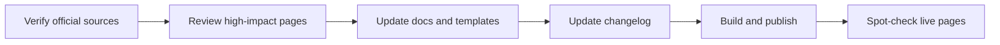

# Quarterly Checklist (Maintainers)

Use this once per quarter to keep the playbook aligned with current NIH/eRA guidance.

## 1) Verify source-of-truth pages

- NIH Common Forms hub
- NIH forms pages (Biosketch Common Form, NIH Supplement, CPOS Common Form)
- Relevant NIH Guide Notices (including new updates after NOT-OD-26-018 / NOT-OD-26-033 / NOT-OD-26-079)
- Research Security Training notices and certification text timing
- eRA Commons ORCID help
- NLM CPOS XML upload + error guidance

## 2) Review high-impact playbook pages

- ORCID setup + troubleshooting pages
- Certification / RST reminder pages
- PI quickstart + complete walkthrough
- CPOS overview + what-to-include
- Appendix long-form guide status note

## 3) Update docs and templates

- Revise wording where policy changed
- Confirm examples/templates still match current guidance
- Add an `Unreleased` changelog note for edits in progress

## 4) Publish and spot-check

- Update `docs/changelog.md`
- Rebuild/redeploy GitHub Pages
- Spot-check key live pages for correctness and formatting

