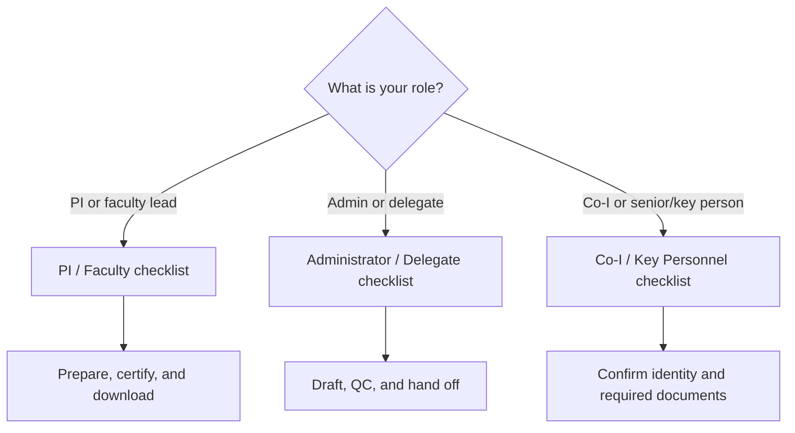

# Quickstarts

Pick the checklist that matches your role. The pages in this section are listed below and in the left navigation.

```mermaid
flowchart TD
    accTitle: Pick the right quickstart
    accDescr: A role-based router sends faculty, administrators, and senior key personnel to the quickstart that matches their work.
    A{"What is your role?"}
    A -- "PI or faculty lead" --> B["PI / Faculty checklist"]
    A -- "Admin or delegate" --> C["Administrator / Delegate checklist"]
    A -- "Co-I or senior/key person" --> D["Co-I / Key Personnel checklist"]
    B --> E["Prepare, certify, and download"]
    C --> F["Draft, QC, and hand off"]
    D --> G["Confirm identity and required documents"]
```
