```mermaid
flowchart LR
    accTitle: Admin delegate quickstart workflow
    accDescr: The admin workflow audits access, drafts documents, performs preview checks, and hands off to the PI for certification.
    A["Audit each person's setup"] --> B["Confirm delegate access"]
    B --> C["Create the documents NIH requests for this role and stage"]
    C --> D["Curate Products and paste narratives"]
    D --> E["Check RST and stage-specific requirements"]
    E --> F["Preview PDFs and send ready-to-certify note"]
    F --> G["Named individual certifies in own account"]
    G --> H["Collect certified PDFs"]
```

# Administrator / Delegate quickstart

## Before you touch SciENcv

1. Ensure each PI/key person has:
   - eRA Commons ID
   - ORCID iD linked to **eRA Commons** (**required**)
   - MyNCBI/SciENcv access working; ORCID appears as the SciENcv **PID** and matches eRA Commons
2. Ask each PI to **add you as a delegate** in MyNCBI.
3. Confirm you have access to:
   - **SciENcv** delegation
   - **My Bibliography** delegation (needed to fix missing products/citations)

## Build the docs (delegate tasks)

- Create or update the SciENcv biosketch for applicable senior/key personnel and, **when NIH requests it for the person's role, mechanism, and submission stage**, the CPOS document
- Import from ORCID (when clean) to reduce manual entry
- Curate products (**up to 10 total**) and verify they align to narratives
- Paste narratives in **plain text**, re-check character counts
- Do a **PDF preview** for formatting/typos

For CPOS, check the NOFO and the applicable NIH Application Guide, JIT, RPPR, or Prior Approval instructions before requesting a document. A narrow exception matters for training grants: the NIH RPPR instructions treat **new training faculty** as new senior/key personnel and require their biosketch Common Form, NIH Supplement, CPOS, and any applicable supplemental documentation.

{: .note }
> **Recipient compliance check:** effective **October 1, 2025**, NIH recipients must provide Other Support disclosure training to all faculty and researchers identified as senior/key personnel, in addition to maintaining a written and enforced disclosure policy. This institutional training obligation is separate from the individual **Research Security Training (RST)** requirement.

Before an application due on/after **May 25, 2026**, verify under your institution’s process that each senior/key person’s RST completion date falls within the 12 months before submission. Also preserve time for the named person’s biosketch certification and the AOR’s separate institutional certification for covered individuals employed by the applicant organization.

## Hand-off to the named individual (required)

- Send each named individual your “ready to certify” note
- The named individual logs in, **certifies**, and downloads the requested PDFs (or lets you download after certification)
- For an RPPR, collect the separate annual MFTRP Section G.1 statement for every senior/key person; do not append it to a Common Form

See [Research-security certifications]({{ site.baseurl }}) and the [submission-lifecycle matrix]({{ site.baseurl }}).

Next: [Delegates (how to collaborate)]({{ site.baseurl }})
