# Administrator / Delegate quickstart

## Before you touch SciENcv

1. Ensure each PI/key person has:
   - eRA Commons ID
   - ORCID iD linked to **eRA Commons** (**required**)
   - MyNCBI/SciENcv access working; ORCID appears as the SciENcv **PID** and matches eRA Commons
2. Ask each PI to **add you as a delegate** in MyNCBI.
3. Confirm you have access to:
   - **SciENcv** delegation
   - **My Bibliography** delegation (needed to fix missing products/citations)

## Build the docs (delegate tasks)

- Create SciENcv biosketch and CPOS documents
- Import from ORCID (when clean) to reduce manual entry
- Curate products (10 total) and verify they align to narratives
- Paste narratives in **plain text**, re-check character counts
- Do a **PDF preview** for formatting/typos

## Hand-off to PI (required)

- Send the PI your “ready to certify” note
- PI logs in, **certifies**, downloads PDFs (or lets you download after)

```mermaid
flowchart LR
    accTitle: Admin delegate quickstart workflow
    accDescr: The admin workflow audits access, drafts documents, performs preview checks, and hands off to the PI for certification.
    A["Audit each person's setup"] --> B["Confirm delegate access"]
    B --> C["Create or update SciENcv documents"]
    C --> D["Curate Products and paste narratives"]
    D --> E["Preview PDFs and check formatting"]
    E --> F["Send ready-to-certify note"]
    F --> G["PI certifies in own account"]
    G --> H["Collect certified PDFs"]
```

Next: [Delegates (how to collaborate)]({{ site.baseurl }})
