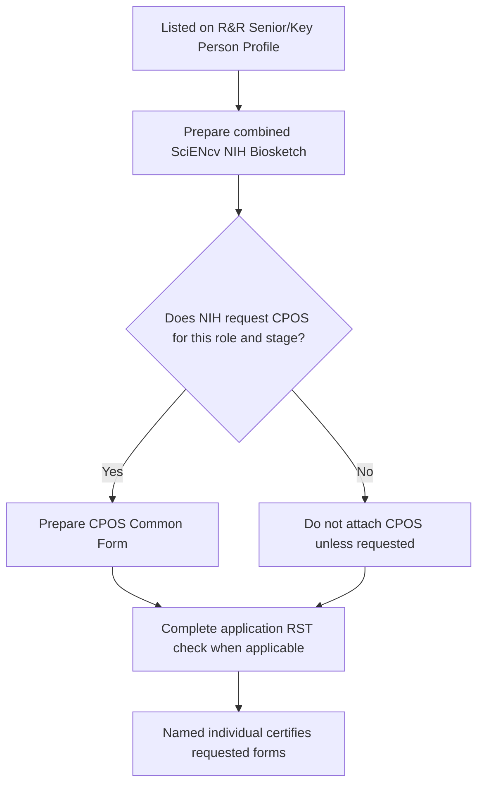

# Co-I / Key Personnel quickstart

Every person listed on the application’s **R&R Senior/Key Person Profile (Expanded)** needs a SciENcv-generated combined **NIH Biosketch**, including every **Other Significant Contributor (OSC)**. See [NIH Common Forms FAQ 57968](https://grants.nih.gov/faqs#/common-forms-biographical-sketch-current-pending-support.htm?anchor=57968) and [FAQ 57969](https://grants.nih.gov/faqs#/common-forms-biographical-sketch-current-pending-support.htm?anchor=57969). You will also need **CPOS / Other Support** when NIH requests it for your role, mechanism, and lifecycle stage.

{: .note }
> Two common exceptions to remember: **CPOS is not required for Other Significant Contributors (OSCs)**, and NIH generally does **not specifically request** CPOS for Program Directors, training faculty, and other oversight individuals in training grants. However, the NIH RPPR instructions treat **new training faculty added in a Training RPPR** as new senior/key personnel; for those individuals, upload the biosketch Common Form, NIH Supplement, CPOS, and any applicable supplemental documentation.

## Quick steps

1. ORCID iD: create (if needed)
2. Link ORCID to **eRA Commons** (**required**) and confirm the same ORCID appears as the SciENcv **PID**
3. Ensure your **My Bibliography** is correct
4. Create the SciENcv documents (or work with your delegate)
5. Complete qualifying **Research Security Training** within the 12 months before application submission
6. **Certify + download each requested PDF** from your own SciENcv account

If your institution is an NIH recipient, complete its required **Other Support disclosure training**. Recipients must train faculty and researchers identified as senior/key personnel on Other Support disclosure responsibilities. This recipient-provided training is separate from **Research Security Training (RST)**.

For an annual RPPR, provide the separate MFTRP statement requested for Section G.1. See [Research-security certifications]({{ site.baseurl }}).

Next: [Biosketch overview (what you’re producing)]({{ site.baseurl }})
